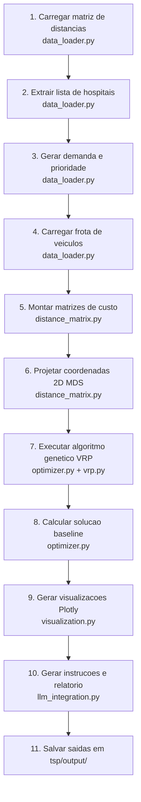

# IADT - Fase 2 - Tech Challenge

Victor Luiz Domingues  
RM: rm375278

---

## Otimizador de Rotas para Distribuição de Medicamentos e Insumos - ORDMI

Solução de otimização de rotas para distribuição de medicamentos e insumos entre hospitais públicos de São Paulo, utilizando algoritmos genéticos (TSP/VRP) e integração com LLM para geração de instruções e relatórios operacionais.

O projeto teve como base a implementação do professor Sergio apresentada em aula e disponibilizada no grupo discord. [https://github.com/sergiopolimante/genetic_algorithm_tsp](https://github.com/sergiopolimante/genetic_algorithm_tsp).

Para o detalhamento técnico completo da implementação, arquitetura e resultados, consulte [RELATÓRIO TÉCNICO](RELATORIO_TECNICO.md).

---

## Como executar

```bash
# 1. Ative o ambiente virtual
source .venv/bin/activate

# 2. Instale as dependências (primeira vez)
pip install -r requirements.txt

# 3. Execute a solução principal (VRP por padrão)
python tsp/run.py
```

As saídas são geradas em `tsp/output/`: mapa de rotas, curva de convergência, instruções de motoristas e relatório operacional.

### Executar o TSP base (opcional)

```bash
python tsp/tsp.py
```

### Rodar os testes

```bash
python -m pytest tsp/tests/ -v
```

## Visão Geral do Fluxo

O diagrama abaixo resume a ordem cronológica de execução, do carregamento dos
dados até a geração dos relatórios finais.



---
