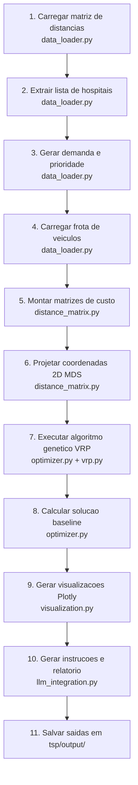

# IADT - Fase 2 - Tech Challenge

Victor Luiz Domingues  
RM: rm375278

---

## Otimizador de Rotas para Distribuição de Medicamentos e Insumos - ORDMI

Solução de otimização de rotas para distribuição de medicamentos e insumos entre hospitais públicos de São Paulo, utilizando algoritmos genéticos (TSP/VRP) e integração com LLM para geração de instruções e relatórios operacionais.

O projeto teve como base a implementação do professor Sergio apresentada em aula e disponibilizada no grupo discord. [https://github.com/sergiopolimante/genetic_algorithm_tsp](https://github.com/sergiopolimante/genetic_algorithm_tsp).

Para o detalhamento técnico completo da implementação, arquitetura e resultados, consulte [RELATÓRIO TÉCNICO](RELATORIO_TECNICO.md).


## Vídeo explicativo

Vídeo de apresentação da solução no YouTube, com a demonstração do funcionamento
do otimizador de rotas (TSP/VRP) e a explicação da arquitetura e dos resultados.

- **Título:** ORDMI — Otimizador de Rotas para Distribuição de Medicamentos e Insumos
- **Link:** _a ser adicionado_ (URL do YouTube)

---

## Relatório Técnico

LEIA TAMBÉM: [RELATÓRIO TÉCNICO](RELATORIO_TECNICO.md).

---

## Estrutura do projeto


Árvore de diretórios da solução, com a descrição de cada arquivo. O escopo do
projeto está concentrado na pasta [`tsp/`](tsp), acompanhada dos arquivos de
apoio na raiz do repositório.

```text
.
├── RELATORIO_TECNICO.md          # Detalhamento técnico completo: arquitetura, premissas, resultados e evidências
├── requirements.txt              # Dependências Python do projeto
├── .env                          # Variáveis de ambiente (chaves de LLM opcionais); não versionado
├── diagramas/                    # Diagramas de projeto (modelagem e documentação visual)
│   ├── diagrama_sequencia_vrp.md # Diagrama de sequência do fluxo VRP (Mermaid)
│   └── ORDMI.drawio.png          # Diagrama de arquitetura da solução (draw.io)
└── tsp/                          # Pacote principal da solução de otimização de rotas (TSP/VRP)
    ├── __init__.py               # Marca a pasta como pacote Python
    ├── config.py                 # Configurações centrais: caminhos, seed e parâmetros do algoritmo genético
    ├── models.py                 # Dataclasses do domínio (Hospital, Vehicle, VrpSolution, prioridade de entrega)
    ├── data_loader.py            # Carrega e normaliza hospitais, matriz de distâncias e frota; gera demanda/prioridade
    ├── distance_matrix.py        # Monta a matriz de custos e projeta coordenadas 2D via MDS para visualização
    ├── genetic_algorithm.py      # Operadores genéticos genéricos (população, crossover, mutação e seleção)
    ├── vrp.py                    # Lógica do VRP: decodifica a rota gigante em rotas por veículo e calcula o fitness
    ├── optimizer.py              # Orquestra o algoritmo genético do VRP e calcula a solução baseline
    ├── visualization.py          # Gera visualizações Plotly (mapa de rotas e curva de convergência)
    ├── llm_integration.py        # Integração com LLM (template/Ollama/OpenAI) para instruções e relatórios
    ├── tsp.py                    # TSP base (caixeiro viajante clássico) com visualização em Pygame
    ├── benchmark_att48.py        # Benchmark do algoritmo genético contra a instância clássica att48
    ├── draw_functions.py         # Funções auxiliares de desenho do TSP base (Pygame)
    ├── run.py                    # Ponto de entrada principal; executa o pipeline VRP (e opcionalmente o TSP base)
    ├── README.md                 # Guia de uso e execução específico do pacote tsp
    ├── bases/                    # Dados de entrada usados pela solução
    │   ├── matriz_distacias_hospitais.csv   # Matriz de distâncias/durações entre hospitais
    │   └── veiculos.csv                      # Cadastro da frota de veículos
    ├── output/                   # Artefatos gerados pela execução
    │   ├── mapa_rotas_otimizadas.html        # Mapa interativo das rotas otimizadas
    │   ├── convergencia_algoritmo_genetico.html  # Curva de convergência do algoritmo genético
    │   ├── instrucoes_motoristas.md          # Instruções de entrega por motorista
    │   └── relatorio_operacional.md          # Relatório operacional da distribuição
    └── tests/                    # Testes automatizados da solução
        ├── __init__.py           # Marca a pasta de testes como pacote Python
        ├── test_vrp_pipeline.py  # Testes do pipeline VRP (carga de dados, otimização e restrições)
        └── test_llm_integration.py  # Testes da integração com LLM
```

---

## Como executar

```bash
# 1. Ative o ambiente virtual
source .venv/bin/activate

# 2. Instale as dependências (primeira vez)
pip install -r requirements.txt

# 3. Execute a solução principal (VRP por padrão)
python tsp/run.py
```

As saídas são geradas em `tsp/output/`: mapa de rotas, curva de convergência, instruções de motoristas e relatório operacional.

### Executar o TSP base (opcional)

```bash
python tsp/tsp.py
```

### Rodar os testes

```bash
python -m pytest tsp/tests/ -v
```

## Visão Geral do Fluxo

O diagrama abaixo resume a ordem cronológica de execução, do carregamento dos
dados até a geração dos relatórios finais.



---
