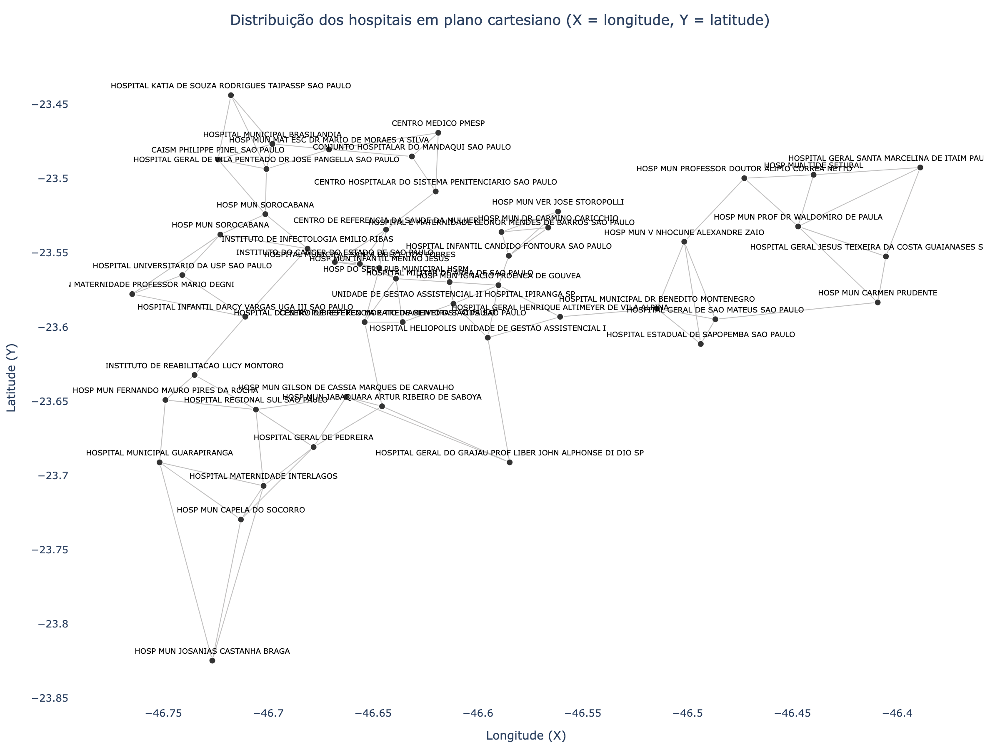
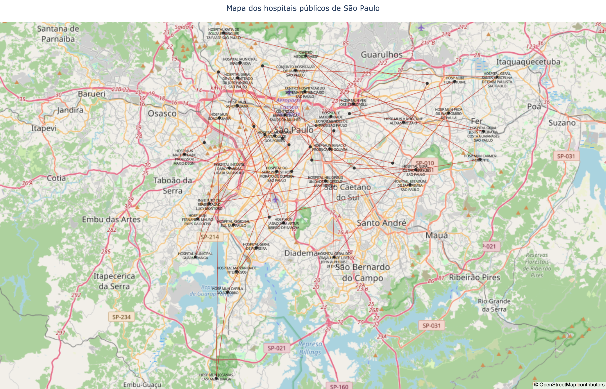
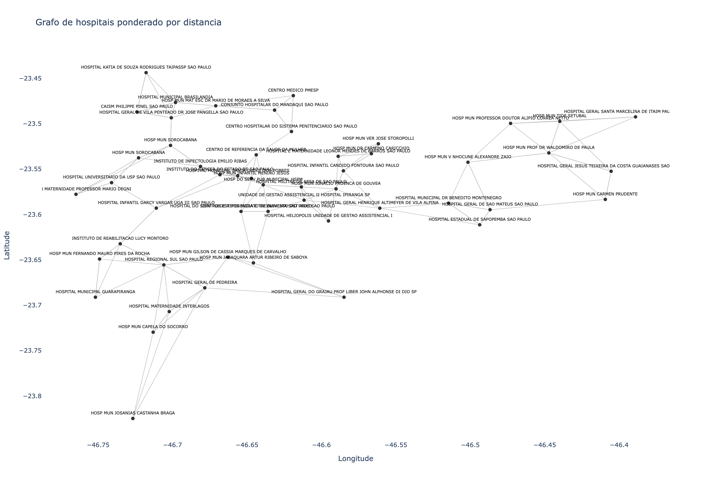
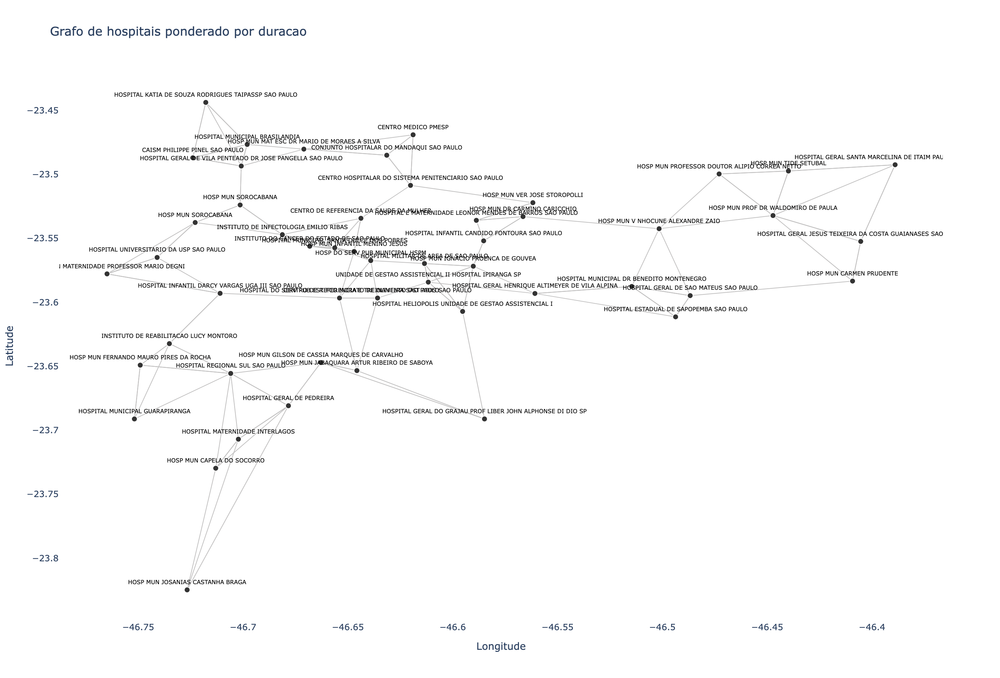
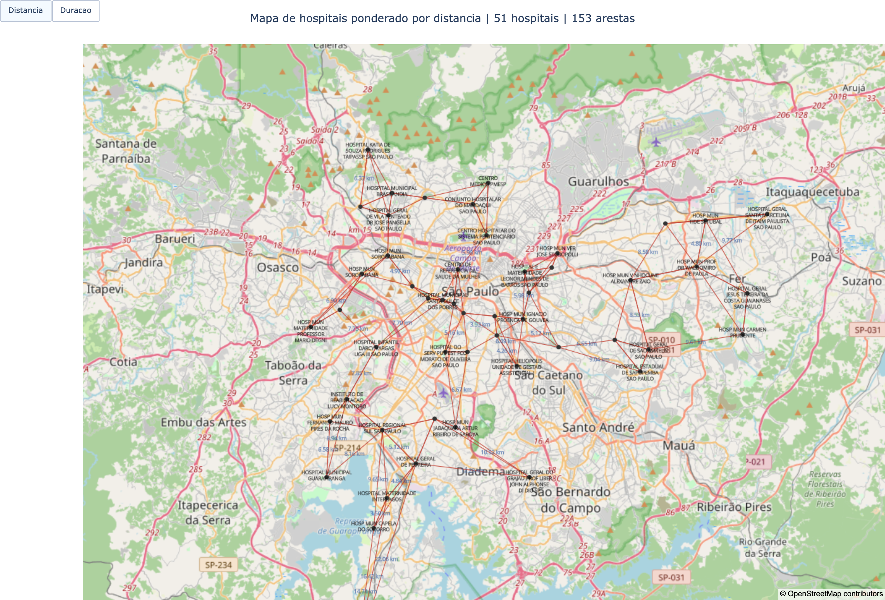

# Otimização de Rotas para Distribuição de Medicamentos e Insumos

**Tech Challenge - Fase 2 - FIAP**  
**Autor:** Victor Luiz Domingues (RM: rm375278)  
**Data:** 2026

---

## 1. Apresentação do Projeto

Este projeto implementa uma solução de otimização de rotas para distribuição de medicamentos e insumos entre hospitais públicos da cidade de São Paulo, utilizando algoritmos genéticos para resolver o problema de roteamento de veículos (Vehicle Routing Problem - VRP). A solução considera restrições reais como capacidade de carga, autonomia dos veículos, prioridades de entrega e múltiplos veículos, além de integrar modelos de linguagem (LLM) para geração automática de instruções de entrega e relatórios operacionais.

O sistema foi desenvolvido em Python, seguindo princípios de engenharia de dados com rastreabilidade, validação, modularização e reprodutibilidade.

---

## 2. Contexto e Motivação

O sistema hospitalar enfrenta desafios logísticos significativos na distribuição eficiente de medicamentos e insumos entre suas diversas unidades e para atendimento domiciliar. A otimização de rotas é fundamental para:

- Reduzir custos operacionais de transporte e combustível
- Garantir entregas prioritárias de medicamentos críticos
- Maximizar a eficiência da frota disponível
- Melhorar o atendimento à população

Este projeto aplica técnicas de inteligência artificial (algoritmos genéticos) e engenharia de dados para resolver esse problema de forma automatizada, escalável e auditável.

---

## 3. Coleta e Preparação das Bases de Dados

### 3.1. Base de Hospitais

**Fonte:** Dados Abertos do Governo Federal - Ministério da Saúde  
**URL:** https://dadosabertos.saude.gov.br/dataset/hospitais-e-leitos/resource/5ac78b13-649f-4b09-8a92-0ae829a56d50  
**Ano de referência:** 2026

A base original contém todos os hospitais nacionais cadastrados. Para fins deste trabalho acadêmico, foi aplicado um recorte geográfico e de natureza jurídica:

- **Filtro aplicado:** `UF = SP`, `MUNICIPIO = SAO PAULO`, `DESC_NATUREZA_JURIDICA = HOSPITAL_PUBLICO`
- **Total de registros após filtro:** 354 hospitais

**Tratamento aplicado:**
1. Normalização dos dados ([`1-normalizar_base.usecase.py`](casos_de_uso/1-normalizar_base.usecase.py))
2. Geração de ID numérico sequencial, extração de nome do hospital e endereço completo
3. Saída: [`bases/normaliza_hospitais_publicos_sao_paulo_sp.csv`](bases/normaliza_hospitais_publicos_sao_paulo_sp.csv)

### 3.2. Base de Veículos

**Fonte:** Programa Brasileiro de Etiquetagem (PBE Veicular) - INMETRO  
**URL:** https://www.gov.br/inmetro/pt-br/assuntos/regulamentacao/avaliacao-da-conformidade/programa-brasileiro-de-etiquetagem/tabelas-de-eficiencia-energetica/veiculos-automotivos-pbe-veicular/mascara-pbev-2026_19_jan-rev01.pdf/view  
**Ano de referência:** 2026

A base contém informações de consumo de combustível (urbano e rodoviário) de diversos modelos de veículos comercializados no Brasil. Foi utilizada para modelar a frota disponível para distribuição, considerando:

- Consumo médio urbano (km/l)
- Segmento do veículo (sedan, SUV, hatch, etc.)
- Autonomia estimada (consumo x tanque)

**Tratamento aplicado:**
1. Seleção de modelos representativos para cada segmento
2. Estimativa de capacidade de carga por segmento
3. Saída: [`bases/veiculos.csv`](bases/veiculos.csv) e [`tsp/bases/veiculos.csv`](tsp/bases/veiculos.csv)

---

## 4. Engenharia de Dados e Integração com APIs Externas

### 4.1. Serviços de Integração

Para transformar a base de hospitais em uma rede roteável, foram implementados serviços de integração com APIs públicas de georreferenciamento e roteamento:

#### 4.1.1. OpenStreetMap (Nominatim)

**Arquivo:** [`servicos/open_street_map/service.py`](servicos/open_street_map/service.py)  
**Responsabilidade:** Geocodificação de endereços (conversão de endereço textual para latitude/longitude)

**Caso de uso executado:**
- [`2-recuperar_latitude_longitude.usecase.py`](casos_de_uso/2-recuperar_latitude_longitude.usecase.py)
- Entrada: [`bases/normaliza_hospitais_publicos_sao_paulo_sp.csv`](bases/normaliza_hospitais_publicos_sao_paulo_sp.csv)
- Saída: [`bases/latitude_longitude_hospitais_publicos_sao_paulo_sp.csv`](bases/latitude_longitude_hospitais_publicos_sao_paulo_sp.csv)

#### 4.1.2. OpenRouteService

**Arquivo:** [`servicos/open_route/service.py`](servicos/open_route/service.py)  
**Responsabilidade:** Cálculo de matriz de distâncias e durações entre todos os pares de hospitais

**Caso de uso executado:**
- [`6-gerar_matriz_distancias.usecase.py`](casos_de_uso/6-gerar_matriz_distancias.usecase.py)
- Entrada: coordenadas (latitude/longitude) dos hospitais
- Saída: [`bases/matriz_distacias.csv`](bases/matriz_distacias.csv) — matriz NxN com distâncias em km e durações em minutos

### 4.2. Pipeline de Casos de Uso

Os casos de uso organizam o fluxo de preparação dos dados de forma modular e auditável:

| Caso de Uso | Arquivo | Descrição |
|---|---|---|
| 1 | [`1-normalizar_base.usecase.py`](casos_de_uso/1-normalizar_base.usecase.py) | Normaliza e limpa a base bruta de hospitais |
| 2 | [`2-recuperar_latitude_longitude.usecase.py`](casos_de_uso/2-recuperar_latitude_longitude.usecase.py) | Geocodifica endereços via OpenStreetMap |
| 3 | [`3-selecionar_hospitais_por_bairro.usecase.py`](casos_de_uso/3-selecionar_hospitais_por_bairro.usecase.py) | Agrupa hospitais por bairro para análise |
| 4 | [`4-calcular_caminhos_possiveis.usecase.py`](casos_de_uso/4-calcular_caminhos_possiveis.usecase.py) | Calcula caminhos entre pares de hospitais |
| 5 | [`5-gerar_imagem_grafo.usecase.py`](casos_de_uso/5-gerar_imagem_grafo.usecase.py) | Gera visualização do grafo de hospitais |
| 6 | [`6-gerar_matriz_distancias.usecase.py`](casos_de_uso/6-gerar_matriz_distancias.usecase.py) | Gera matriz de custos de roteamento |
| 7 | [`7-gerar_imagem_grafo_matriz_distancias.usecase.py`](casos_de_uso/7-gerar_imagem_grafo_matriz_distancias.usecase.py) | Visualiza grafo ponderado pela matriz de custos |
| 8 | [`8-gerar_dataset_carros.usecase.py`](casos_de_uso/8-gerar_dataset_carros.usecase.py) | Prepara catálogo de veículos para o VRP |

### 4.3. Redução da Base para o Módulo TSP

Para viabilizar a execução do algoritmo genético em tempo razoável e permitir validação acadêmica, foi feita uma redução da base original:

- **Base original:** 354 hospitais
- **Base reduzida (`tsp/bases`):** 51 hospitais
- **Critério de seleção:** distribuição geográfica representativa e hospitais de referência
- **Resultado:** [`tsp/bases/matriz_distacias_hospitais.csv`](tsp/bases/matriz_distacias_hospitais.csv) — matriz 51x51 de distâncias e durações

---

## 5. Validação e Testes

### 5.1. Testes da Camada de Integração

**Diretório:** `tests/` (raiz do repositório)  
**Arquivo:** [`tests/test_open_street_map_service.py`](tests/test_open_street_map_service.py)

Validação de comportamento dos serviços de geocodificação e roteamento:
- Teste de conexão com API OpenStreetMap
- Validação de formato de resposta
- Tratamento de erros de rede e timeouts

**Execução:**
```bash
python -m pytest tests/ -v
```

### 5.2. Testes da Solução de Otimização

**Diretório:** `tsp/tests/`  
**Arquivos:** [`tsp/tests/test_vrp_pipeline.py`](tsp/tests/test_vrp_pipeline.py), [`tsp/tests/test_llm_integration.py`](tsp/tests/test_llm_integration.py)

Validações da pipeline completa de otimização:

| Teste | Descrição |
|---|---|
| `test_carga_dados` | Valida integridade da matriz de distâncias e catálogo de veículos |
| `test_restricao_capacidade` | Garante que rotas respeitam limite de carga dos veículos |
| `test_restricao_autonomia` | Garante que rotas respeitam autonomia máxima dos veículos |
| `test_convergencia_ga` | Valida que o fitness melhora ao longo das gerações |
| `test_selecao_cliente_llm` | Valida prioridade de seleção (Template > Ollama > OpenAI) |
| `test_chamada_llm_mockada` | Testa integração HTTP com APIs de LLM |

**Execução:**
```bash
python -m pytest tsp/tests/ -v
```

**Resultado esperado:** 13 testes passando, validando toda a pipeline end-to-end.

---

## 6. Arquitetura da Solução de Otimização (Módulo TSP)

### 6.1. Visão Geral

O módulo `tsp/` implementa a solução de otimização propriamente dita, consumindo as bases preparadas nas etapas anteriores. A arquitetura é modular, separando responsabilidades claras:

```
tsp/
├── bases/                          # Dados de entrada
│   ├── matriz_distacias_hospitais.csv
│   └── veiculos.csv
├── output/                         # Resultados gerados
│   ├── mapa_rotas_otimizadas.html
│   ├── convergencia_algoritmo_genetico.html
│   ├── instrucoes_motoristas.txt
│   └── relatorio_operacional.txt
├── tests/                          # Testes automatizados
├── config.py                       # Parâmetros e hiperparâmetros
├── models.py                       # Estruturas de dados
├── data_loader.py                  # Carga e validação de dados
├── distance_matrix.py              # Matriz de custos e projeção 2D
├── vrp.py                          # Lógica de VRP (split e fitness)
├── genetic_algorithm.py            # Operadores genéticos base (TSP)
├── optimizer.py                    # Execução do AG e baseline
├── visualization.py                # Gráficos interativos
├── llm_integration.py              # Integração com LLMs
├── tsp.py                          # TSP clássico (benchmark)
└── run.py                          # Entrypoint principal
```

### 6.2. Estrutura dos Módulos

| Arquivo | Responsabilidade |
|---|---|
| [`config.py`](tsp/config.py) | Parâmetros globais: seed, hiperparâmetros do GA, pesos de fitness, paths |
| [`models.py`](tsp/models.py) | Dataclasses: `Hospital`, `Vehicle`, `VehicleRoute`, `VrpSolution`, `DeliveryPriority` |
| [`data_loader.py`](tsp/data_loader.py) | Carrega [`tsp/bases/matriz_distacias_hospitais.csv`](tsp/bases/matriz_distacias_hospitais.csv) e [`tsp/bases/veiculos.csv`](tsp/bases/veiculos.csv); gera demanda e prioridade sintéticas |
| [`distance_matrix.py`](tsp/distance_matrix.py) | Monta matriz de custos (distância/duração) e projeção 2D via MDS (Multidimensional Scaling) |
| [`vrp.py`](tsp/vrp.py) | Decodifica cromossomo ("rota gigante") em rotas por veículo; calcula fitness com restrições |
| [`genetic_algorithm.py`](tsp/genetic_algorithm.py) | Operadores genéticos: geração de população, crossover OX, mutação, seleção (do TSP base fornecido) |
| [`optimizer.py`](tsp/optimizer.py) | Executa algoritmo genético do VRP; calcula solução baseline (nearest neighbor) |
| [`visualization.py`](tsp/visualization.py) | Gráficos interativos Plotly: mapa de rotas por veículo e curva de convergência do GA |
| [`llm_integration.py`](tsp/llm_integration.py) | Geração de instruções/relatórios via Template (padrão), Ollama ou OpenAI |
| [`tsp.py`](tsp/tsp.py) | TSP clássico: AG aplicado aos hospitais reais (1 rota, sem restrições de frota), com visualização Pygame |
| [`run.py`](tsp/run.py) | Entrypoint principal: executa VRP (e opcionalmente TSP base) e gera comparativo |
| [`benchmark_att48.py`](tsp/benchmark_att48.py) | Benchmark TSP clássico (att48) mantido do projeto base |
| [`draw_functions.py`](tsp/draw_functions.py) | Funções de visualização Pygame, reaproveitadas por [`tsp.py`](tsp/tsp.py) |

Componentes relacionados fora de `./tsp`:

- [`servicos/`](servicos/): clientes de integração para OpenStreetMap e OpenRouteService
- [`tests/`](tests/): testes da camada de serviços de dados do repositório

### 6.3. Premissas e Dados Sintéticos

As bases de entrada não contêm todos os atributos necessários para modelar um VRP realista. As seguintes premissas foram adotadas de forma **determinística** (seed fixa `RANDOM_SEED = 42`), garantindo reprodutibilidade:

#### Dados Sintéticos Gerados

| Atributo | Fonte/Estimativa | Justificativa |
|---|---|---|
| **Demanda por hospital (kg)** | Sorteada uniformemente entre 10-100 kg | Matriz de distâncias não informa volume de insumos |
| **Prioridade de entrega** | ~30% marcadas como `CRITICAL` | Simula medicamentos críticos vs. insumos regulares |
| **Capacidade de carga (kg)** | Estimada por segmento de veículo | Base PBE traz apenas consumo, não capacidade |
| **Tanque de combustível (L)** | Assumido 50L para todos os veículos | Padrão representativo de veículos leves |
| **Autonomia (km)** | `consumo_cidade (km/l) × 50L` | Calculada a partir do consumo real do PBE |
| **Centro de Distribuição** | Hospital ID=1 | Base não possui depósito logístico separado |
| **Coordenadas lat/long** | Projeção MDS 2D a partir da matriz real | Base reduzida não possui coordenadas geográficas |

**Capacidade estimada por segmento:**
- Sedan: 350 kg
- SUV: 450 kg
- Hatch: 300 kg
- Picape: 600 kg

---

## 7. Modelagem do Problema de Roteamento de Veículos (VRP)

### 7.1. Representação Genética

O cromossomo representa uma **rota gigante**: permutação de todos os hospitais (exceto o depósito), sem separadores de rota.

**Exemplo de cromossomo:**
```
[15, 3, 42, 8, 25, 11, ..., 50]
```

Cada número representa o ID de um hospital. A ordem define a sequência de visitas.

### 7.2. Decodificação (Split Route)

A rota gigante é decodificada em rotas individuais por veículo respeitando restrições:

1. Inicia no depósito (hospital ID=1)
2. Percorre o cromossomo em ordem, acumulando:
   - Carga transportada (kg)
   - Distância percorrida (km)
3. Ao violar capacidade OU autonomia:
   - Fecha a rota atual (retorna ao depósito)
   - Inicia nova rota com o próximo veículo da frota
4. Permite rotação de veículos (um mesmo veículo pode fazer múltiplas viagens)

**Função:** [`vrp.py`](tsp/vrp.py) — `split_route_by_vehicle_constraints()`

### 7.3. Função Fitness (Minimização)

```python
fitness = distancia_total + penalidade_prioridade + penalidade_nao_atendidos
```

**Componentes:**

1. **Distância total percorrida (km):** soma de todas as rotas
2. **Penalidade de atraso em entregas críticas:**
   - Para cada hospital marcado como `CRITICAL`: `(posicao_global / num_hospitais) × peso_prioridade`
   - Penaliza entregas críticas que aparecem tarde na sequência
   - Peso: `PESO_PENALIDADE_PRIORIDADE = 500`
3. **Penalidade por não atendimento:**
   - Se um hospital não pode ser atendido (demanda excede capacidade máxima da frota): penalidade alta
   - Peso: `PESO_PENALIDADE_NAO_ATENDIDO = 10000`

**Função:** [`vrp.py`](tsp/vrp.py) — `calcular_fitness_vrp()`

### 7.4. Operadores Genéticos

| Operador | Técnica | Parâmetro |
|---|---|---|
| **Seleção** | Amostragem ponderada por inverso do fitness | - |
| **Crossover** | Order Crossover (OX) | Taxa: 80% |
| **Mutação** | Swap de duas posições aleatórias | Taxa: 20% |
| **Elitismo** | Top 10% da população passa direto | 10% |
| **Tamanho da população** | - | 100 indivíduos |
| **Número de gerações** | - | 500 |

**Módulo:** [`genetic_algorithm.py`](tsp/genetic_algorithm.py) (base do TSP fornecido, reaproveitado e estendido)

### 7.5. Solução Baseline

Para comparação, é gerada uma solução baseline usando **Nearest Neighbor Heuristic:**

1. Inicia no depósito
2. A cada passo, visita o hospital não visitado mais próximo
3. Aplica as mesmas restrições de capacidade e autonomia do VRP otimizado

**Função:** [`optimizer.py`](tsp/optimizer.py) — `calcular_baseline_nearest_neighbor()`

---

## 8. Integração com LLMs para Relatórios e Instruções

### 8.1. Estratégia de Prioridade

O sistema suporta três modos de geração de texto:

1. **Template (padrão):** geração baseada em strings formatadas, 100% offline, sem custo
2. **Ollama:** modelo local (ex: llama3.1), sem custo, sem envio de dados externos
3. **OpenAI:** API paga (ex: gpt-4o-mini), requer chave de API

**Prioridade de seleção:** Template > Ollama > OpenAI

**Configuração via variáveis de ambiente:**
```bash
export OLLAMA_MODEL="llama3.1"
export OLLAMA_BASE_URL="http://localhost:11434/api/chat"

export OPENAI_API_KEY="sua-chave"
export OPENAI_BASE_URL="https://api.openai.com/v1/chat/completions"
export OPENAI_MODEL="gpt-4o-mini"
```

**Módulo:** [`llm_integration.py`](tsp/llm_integration.py)

### 8.2. Saídas Geradas

1. **Instruções para motoristas** (`instrucoes_motoristas.txt`):
   - Sequência de entregas por rota
   - Endereços dos hospitais
   - Prioridade de cada entrega
   - Estimativa de tempo de viagem

2. **Relatório operacional** (`relatorio_operacional.txt`):
   - Comparativo entre solução otimizada e baseline
   - Métricas: distância total, número de rotas, posição média de entregas críticas
   - Ganhos operacionais (% de redução de distância)

3. **Resposta a perguntas** (função `responder_pergunta()`):
   - Permite Q&A em linguagem natural sobre as rotas

---

## 9. Resultados Visuais

### 9.1. Grafos e Mapas dos Hospitais (Etapa de Preparação)

As visualizações abaixo foram geradas pelos casos de uso de engenharia de dados ([`casos_de_uso/`](casos_de_uso/)), salvos em [`bases/graficos/`](bases/graficos/).

#### Grafo cartesiano dos hospitais selecionados:



#### Mapa dos hospitais selecionados:



#### Grafo ponderado pela matriz de distâncias (km):



#### Grafo ponderado pela matriz de durações (minutos):



#### Mapa com pesos de distância (km):



#### Mapa com pesos de duração (minutos):


### 9.2. Visualizações da Solução Otimizada (Saída do VRP)

**Localização:** `tsp/output/`

1. **Mapa interativo de rotas** (`mapa_rotas_otimizadas.html`):
   - Rotas coloridas por veículo
   - Hospitais marcados com prioridade
   - Linhas representando sequência de visitas
   - Interativo (Plotly): zoom, hover com detalhes

2. **Curva de convergência do algoritmo genético** (`convergencia_algoritmo_genetico.html`):
   - Eixo X: geração
   - Eixo Y: melhor fitness da população
   - Demonstra melhoria ao longo das iterações

---

## 10. Como Executar o Projeto

### 10.1. Ativar Ambiente Virtual

```bash
# a partir da raiz do repositório
source .venv/bin/activate
```

### 10.2. Executar a Solução VRP (Padrão)

```bash
# roda somente o VRP hospitalar completo com relatórios
python tsp/run.py
```

**Saídas geradas em `tsp/output/`:**
- `mapa_rotas_otimizadas.html`
- `convergencia_algoritmo_genetico.html`
- `instrucoes_motoristas.txt`
- `relatorio_operacional.txt`

### 10.3. Executar TSP Base (Opcional)

```bash
# roda apenas o TSP clássico (algoritmo genético sem restrições de frota)
python tsp/tsp.py
```

Abre janela Pygame com visualização da rota sendo otimizada. Pressione `Q` para fechar.

### 10.4. Executar TSP + VRP em Sequência

Para comparar as duas abordagens (TSP clássico vs VRP com restrições):

1. Edite [`tsp/config.py`](tsp/config.py):
   ```python
   EXECUTAR_TSP_BASE = True
   ```

2. Execute:
   ```bash
   python tsp/run.py
   ```

3. Feche a janela do Pygame (ou pressione `Q`) para prosseguir para o VRP.

4. Ao final, um resumo comparativo será impresso.

### 10.5. Executar Testes

```bash
# testes da solução TSP/VRP e integração LLM
python -m pytest tsp/tests/ -v

# testes dos serviços de integração de dados
python -m pytest tests/ -v
```

---

## 11. Requisitos Entregues (Tech Challenge Fase 2)

### 11.1. Sistema de Otimização de Rotas via Algoritmos Genéticos

- **Representação genética adequada:** cromossomo como permutação de hospitais (rota gigante)
- **Operadores genéticos especializados:** seleção, crossover OX, mutação por swap, elitismo
- **Função fitness multi-objetivo:** distância + prioridade + restrições de atendimento

### 11.2. Restrições Realistas

- **Prioridades de entrega:** medicamentos críticos vs. insumos regulares (30% críticos)
- **Capacidade limitada de carga:** restrição por segmento de veículo (300-600 kg)
- **Autonomia limitada:** calculada a partir do consumo real PBE × tanque
- **Múltiplos veículos:** problema de VRP, não apenas TSP
- **Outras restrições:** centro de distribuição, rotação de veículos

### 11.3. Visualização em Mapa

- **Mapa interativo Plotly:** rotas coloridas por veículo, hospitais marcados com prioridade
- **Gráfico de convergência:** demonstra evolução do fitness ao longo das gerações
- **Grafos de análise:** visualização da rede de hospitais e matriz de custos

### 11.4. Integração com LLMs

- **Instruções para motoristas:** texto claro e acionável por rota
- **Relatórios operacionais:** comparação com baseline, métricas de ganho
- **Resposta a perguntas em linguagem natural:** função Q&A sobre as rotas
- **Suporte a múltiplos backends:** Template (padrão), Ollama (local), OpenAI (nuvem)

---

## 12. Diferenciais Implementados

- **Rastreabilidade completa:** pipeline modular com casos de uso documentados
- **Reprodutibilidade:** seed fixa para dados sintéticos, mesmos resultados em todas as execuções
- **Engenharia de dados:** integração com APIs externas (OpenStreetMap, OpenRouteService)
- **Validação automatizada:** 13 testes cobrindo carga de dados, restrições, convergência e LLM
- **Solução baseline:** comparativo objetivo com heurística Nearest Neighbor
- **Múltiplos modos de execução:** TSP puro, VRP puro, ou comparativo lado a lado
- **Zero custo operacional:** funciona 100% offline com template de texto (sem necessidade de LLM paga)

---

## 13. Sobre o Resultado: Distância vs. Priorização

O algoritmo genético otimiza o **fitness combinado**, não apenas a distância. Em cenários com muitas entregas críticas, o GA pode aceitar uma distância total levemente maior para garantir que os hospitais críticos sejam atendidos bem mais cedo na sequência de despacho.

**Métrica-chave:** posição média de entregas críticas na sequência global

Esse comparativo evidencia o **ganho operacional real** do sistema para o contexto hospitalar, mesmo quando a distância bruta não diminui significativamente. A priorização salva vidas.

---

## 14. Conclusão

Este projeto implementou uma solução completa de otimização de rotas médicas, integrando:

1. **Engenharia de dados:** coleta, tratamento e enriquecimento de bases públicas
2. **Algoritmos genéticos:** TSP e VRP com restrições realistas
3. **Integração com LLMs:** geração automática de instruções e relatórios
4. **Validação rigorosa:** testes automatizados e comparação com baseline

A solução é escalável, auditável e pronta para aplicação em cenários reais de distribuição hospitalar.

---

## 15. Fontes e Referências

**Bases de dados:**
- Hospitais: https://dadosabertos.saude.gov.br/dataset/hospitais-e-leitos
- Veículos: https://www.gov.br/inmetro (PBE Veicular 2026)

**APIs utilizadas:**
- OpenStreetMap Nominatim: https://nominatim.openstreetmap.org
- OpenRouteService: https://openrouteservice.org

**Tecnologias:**
- Python 3.12.4
- Bibliotecas: pandas, numpy, plotly, pygame, requests, networkx, matplotlib
- LLMs: Ollama (local) e OpenAI (API)

---

Victor Luiz Domingues