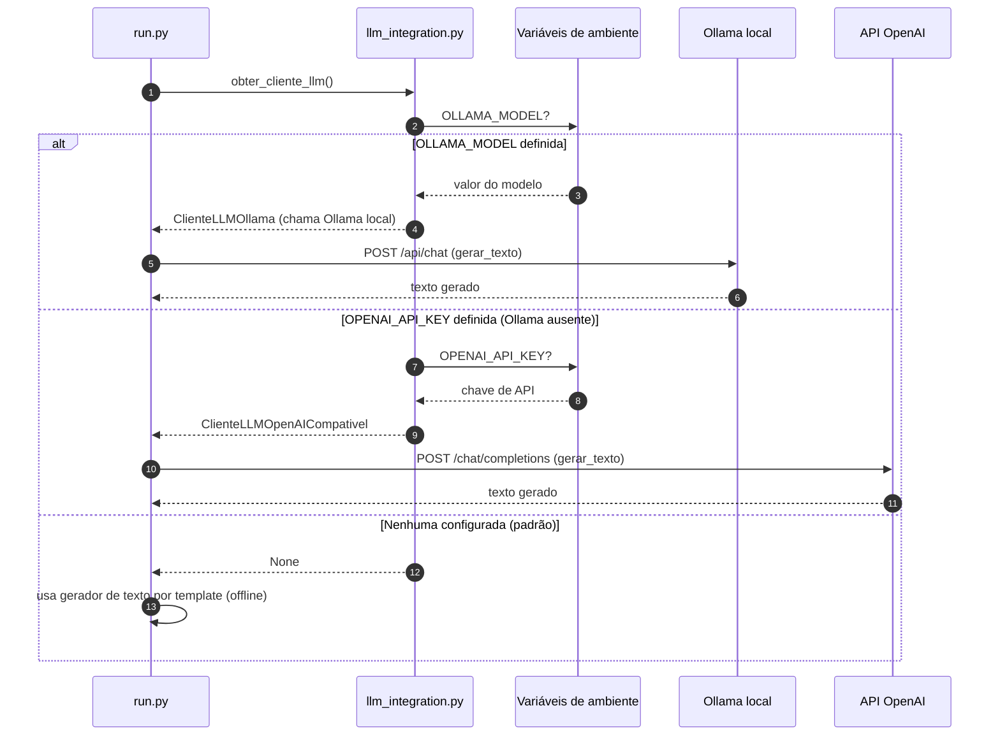

# Diagrama de Sequência — Pipeline VRP Hospitalar (ORDMI)

Este diagrama descreve, passo a passo, o fluxo de execução do módulo [`tsp/`](../tsp/)
a partir do ponto de entrada [`tsp/run.py`](../tsp/run.py), cobrindo a carga de
dados, a geração de premissas sintéticas, a construção das matrizes de custo, a
otimização por algoritmo genético (VRP), a solução baseline, as visualizações e a
geração de instruções/relatórios via LLM (ou template).

## Fluxo principal (`main` → `executar_pipeline_vrp`)

```mermaid
sequenceDiagram
    autonumber
    actor Usuario as Usuário
    participant Run as run.py
    participant Loader as data_loader.py
    participant Dist as distance_matrix.py
    participant Opt as optimizer.py
    participant Vrp as vrp.py
    participant GA as genetic_algorithm.py
    participant Viz as visualization.py
    participant LLM as llm_integration.py
    participant FS as output/ (arquivos)

    Usuario->>Run: python tsp/run.py
    activate Run
    Run->>Run: main(executar_tsp_base=config.EXECUTAR_TSP_BASE)

    opt EXECUTAR_TSP_BASE = True
        Run->>Run: executar_tsp_hospitais() (Pygame, TSP clássico)
        Run-->>Run: distancia_tsp (1 rota, sem restrições)
    end

    Run->>Run: executar_pipeline_vrp()
    activate Run

    Note over Run,Loader: 1-2. Carga de dados + premissas sintéticas
    Run->>Loader: carregar_matriz_distancias()
    Loader->>Loader: lê matriz_distacias_hospitais.csv (filtra status "ok")
    Loader-->>Run: df_matriz
    Run->>Loader: construir_lista_hospitais_base(df_matriz)
    Loader-->>Run: df_hospitais_base (id, name, district)
    Run->>Loader: gerar_demandas_hospitais(df_hospitais_base)
    Loader->>Loader: sorteia demanda (10-100 kg) e prioridade (~30% CRITICAL), seed=42
    Loader-->>Run: hospitais[]
    Run->>Loader: carregar_frota()
    Loader->>Loader: lê veiculos.csv, estima capacidade/autonomia por segmento
    Loader-->>Run: frota[]

    Note over Run,Dist: 3. Matrizes de custo + projeção 2D (MDS)
    Run->>Dist: construir_matriz_custos(df_matriz, ids, "distance_km")
    Dist-->>Run: matriz_distancias_km
    Run->>Dist: construir_matriz_custos(df_matriz, ids, "duration_minutes")
    Dist-->>Run: matriz_duracoes_min
    Run->>Dist: calcular_coordenadas_mds(matriz_distancias_km)
    Dist-->>Run: coordenadas_mds (x, y para o mapa)

    Note over Run,GA: 4. Otimização por Algoritmo Genético (VRP)
    Run->>Opt: executar_algoritmo_genetico_vrp(...)
    activate Opt
    Opt->>GA: generate_random_population(genes, population_size)
    GA-->>Opt: populacao inicial
    loop N_GENERATIONS (500 gerações)
        Opt->>Vrp: decodificar_rota_gigante(individuo, frota, ...)
        Vrp->>Vrp: split_route_by_vehicle_constraints (capacidade/autonomia)
        Vrp-->>Opt: VrpSolution (rotas por veículo)
        Opt->>Vrp: calcular_fitness_vrp(solucao)
        Vrp-->>Opt: fitness (distância + penalidades)
        Opt->>Opt: ordena por fitness + elitismo (top 10%)
        Opt->>GA: select_parents_by_fitness()
        GA-->>Opt: pais
        Opt->>GA: order_crossover(pai1, pai2)
        GA-->>Opt: filho
        Opt->>GA: mutate(filho, mutation_probability)
        GA-->>Opt: nova população
    end
    Opt-->>Run: melhor_solucao, historico_fitness
    deactivate Opt

    Note over Run,Vrp: 5. Solução baseline (comparação)
    Run->>Opt: calcular_solucao_baseline(...)
    Opt->>Vrp: decodificar_rota_gigante(ordem de cadastro)
    Vrp-->>Opt: solucao_baseline
    Opt-->>Run: solucao_baseline

    Note over Run,FS: 6. Visualizações interativas (Plotly)
    Run->>Viz: plotar_mapa_rotas(melhor_solucao, coordenadas_mds, ...)
    Viz-->>Run: figura_mapa
    Run->>Viz: plotar_convergencia(historico_fitness)
    Viz-->>Run: figura_convergencia
    Run->>FS: write_html(mapa_rotas_otimizadas.html, cdn)
    Run->>FS: write_html(convergencia_algoritmo_genetico.html, cdn)

    Note over Run,LLM: 7. Instruções e relatório (LLM ou template)
    Run->>LLM: obter_cliente_llm()
    LLM->>LLM: prioridade Template > Ollama > OpenAI
    LLM-->>Run: cliente_llm (ou None → template)
    loop cada rota da melhor_solucao
        Run->>LLM: gerar_instrucoes_motorista(rota, hospitais, cliente)
        LLM-->>Run: texto de instruções
    end
    Run->>LLM: gerar_relatorio_operacional(otimizado, baseline, cliente)
    LLM-->>Run: relatório comparativo
    Run->>FS: write_text(instrucoes_motoristas.md)
    Run->>FS: write_text(relatorio_operacional.md)

    Run-->>Run: retorna (melhor_solucao, solucao_baseline)
    deactivate Run

    Note over Run,Usuario: 8. Resumo comparativo no console
    Run-->>Usuario: imprime TSP base (opcional) vs VRP otimizado vs baseline
    deactivate Run
```

## Detalhe da seleção do cliente LLM (`obter_cliente_llm`)



## Legenda dos participantes

| Participante | Arquivo | Responsabilidade |
|---|---|---|
| `run.py` | [`tsp/run.py`](../tsp/run.py) | Orquestra o pipeline e imprime o resumo |
| `data_loader.py` | [`tsp/data_loader.py`](../tsp/data_loader.py) | Carga de dados e premissas sintéticas (demanda, prioridade, frota) |
| `distance_matrix.py` | [`tsp/distance_matrix.py`](../tsp/distance_matrix.py) | Matrizes de custo e projeção 2D via MDS |
| `optimizer.py` | [`tsp/optimizer.py`](../tsp/optimizer.py) | Loop do algoritmo genético e baseline nearest neighbor |
| `vrp.py` | [`tsp/vrp.py`](../tsp/vrp.py) | Decodificação da rota gigante e cálculo de fitness |
| `genetic_algorithm.py` | [`tsp/genetic_algorithm.py`](../tsp/genetic_algorithm.py) | Operadores genéticos (população, crossover OX, mutação, seleção) |
| `visualization.py` | [`tsp/visualization.py`](../tsp/visualization.py) | Gráficos Plotly (mapa de rotas e convergência) |
| `llm_integration.py` | [`tsp/llm_integration.py`](../tsp/llm_integration.py) | Instruções e relatórios via Template/Ollama/OpenAI |
```
