# Rota 1: Entrega Hospitalar

## Resumo Operacional

| Item                     | Detalhes                      |
|--------------------------|-------------------------------|
| **Veículo**              | VW VIRTUS                     |
| **Capacidade**           | 350 kg                        |
| **Autonomia**            | 415 km                        |
| **Distância Total**      | 102.2 km                      |
| **Duração Estimada**     | 165.8 min                     |
| **Carga Total**          | 335.0 kg                      |

## Checklist Antes da Partida

- [ ] Verificar nível de combustível do veículo
- [ ] Conferir a carga total e peso
- [ ] Checar condições de segurança do veículo
- [ ] Confirmar endereços e horários de entrega
- [ ] Garantir que a documentação necessária está a bordo
- [ ] Revisar o estado dos medicamentos e cargas sensíveis
- [ ] Equipar o veículo com kit de primeiros socorros

## Paradas Programadas

| Nº | Local de Entrega                                                       | Prioridade | Carga (kg) | Orientação                          |
|----|-----------------------------------------------------------------------|------------|------------|-------------------------------------|
| 1  | HOSP MUN V NHOCUNE ALEXANDRE ZAIO (VILA NHOCUNE)                     | REGULAR    | 28.8       | Entregar no setor de emergência     |
| 2  | HOSPITAL MUNICIPAL DR BENEDITO MONTENEGRO (JARDIM IVA)              | REGULAR    | 102.7      | Conferir recepção de medicamentos   |
| 3  | HOSP MUN CARMEN PRUDENTE (CIDADE TIRADENTES)                         | REGULAR    | 119.7      | Entregar no setor pediátrico        |
| 4  | HOSPITAL INFANTIL CANDIDO FONTOURA SAO PAULO (AGUA RASA)            | REGULAR    | 44.7       | Priorizar entrega de medicamentos    |
| 5  | HOSP MUN FERNANDO MAURO PIRES DA ROCHA (CAMPO LIMPO)                 | REGULAR    | 39.1       | Confirmar recebimento na recepção   |

## Alertas de Segurança

⚠️ **Cuidado com medicamentos**: Verifique a temperatura e condições de armazenamento durante o transporte.

🚨 **Entrega Crítica**: As entregas de medicamentos devem ser priorizadas e realizadas com a máxima urgência.

## Checklist de Encerramento

- [ ] Confirmar entrega de todas as cargas
- [ ] Coletar assinaturas de recebimento
- [ ] Verificar se não há itens esquecidos no veículo
- [ ] Realizar inspeção final do veículo
- [ ] Atualizar registro de entregas realizadas
- [ ] Reportar qualquer incidente ou anomalia durante a entrega

## Fluxo da rota

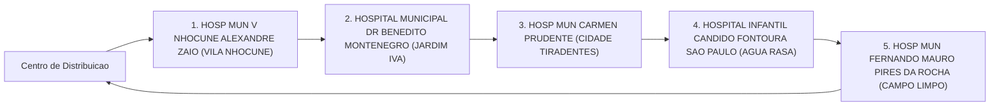
_Fluxo operacional da Rota 1._

---

# Rota 2: Entrega Hospitalar

## Resumo Operacional

| Item                     | Detalhes                      |
|--------------------------|-------------------------------|
| **Veículo**              | PEUGEOT 208                   |
| **Capacidade**           | 350 kg                        |
| **Autonomia**            | 415 km                        |
| **Distância Total**      | 82.1 km                       |
| **Duração Estimada**     | 127.4 min                     |
| **Carga Total**          | 295.0 kg                      |

## Checklist Antes da Partida

- [ ] Verificar nível de combustível do veículo
- [ ] Conferir a carga total e seu peso
- [ ] Garantir que a carga está devidamente fixada
- [ ] Checar a documentação necessária para transporte
- [ ] Revisar o itinerário e as paradas programadas
- [ ] Equipar o veículo com kit de primeiros socorros

## Paradas Programadas

| Nº | Local de Entrega                                                        | Prioridade | Carga (kg) | Orientação                      |
|----|-------------------------------------------------------------------------|------------|------------|---------------------------------|
| 1  | HOSPITAL GERAL HENRIQUE ALTIMEYER DE VILA ALPINA                       | REGULAR    | 115.3      | Entrega padrão                  |
| 2  | HOSP MUN PROFESSOR DOUTOR ALIPIO CORREA NETTO                          | REGULAR    | 71.3       | Entrega padrão                  |
| 3  | HOSPITAL GERAL SANTA MARCELINA DE ITAIM PAULISTA SAO PAULO            | REGULAR    | 69.0       | Entrega padrão                  |
| 4  | HOSP MUN DR CARMINO CARICCHIO                                          | REGULAR    | 39.4       | Entrega padrão                  |

## Alertas de Segurança

⚠️ **Cuidado com medicamentos**: Verifique se a carga contém medicamentos que necessitam de condições especiais de transporte. 

🚨 **Entrega Crítica**: Assegure-se de que as entregas sejam realizadas dentro do prazo para evitar comprometimento da saúde dos pacientes.

## Checklist de Encerramento

- [ ] Confirmar entrega de todos os itens na lista
- [ ] Coletar assinaturas de recebimento nos locais de entrega
- [ ] Verificar se não há carga restante no veículo
- [ ] Realizar inspeção final do veículo
- [ ] Registrar qualquer incidente ou atraso ocorrido durante a rota
- [ ] Reportar a conclusão da entrega à central logística

## Fluxo da rota

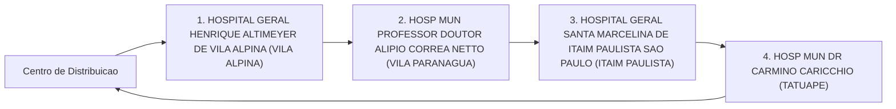
_Fluxo operacional da Rota 2._

---

# Rota 3: Entrega Hospitalar

## Resumo Operacional

| Item                       | Detalhes                     |
|----------------------------|------------------------------|
| **Veículo**                | Hyundai CRETA                |
| **Capacidade**             | 350 kg                       |
| **Autonomia**              | 420 km                       |
| **Distância Total**        | 64.0 km                      |
| **Duração Estimada**       | 112.5 min                    |
| **Carga Total**            | 304.0 kg                     |

## Checklist Antes da Partida

- [ ] Verificar a carga total (304.0 kg).
- [ ] Confirmar a capacidade do veículo (350 kg).
- [ ] Checar a autonomia do veículo (420 km).
- [ ] Revisar a rota e as paradas programadas.
- [ ] Garantir que todos os medicamentos estejam devidamente armazenados e identificados.
- [ ] Conferir documentação necessária para transporte.

## Paradas Programadas

| Nº | Local de Entrega                                                   | Prioridade | Carga   | Orientação                             |
|----|-------------------------------------------------------------------|------------|---------|----------------------------------------|
| 1  | HOSPITAL DO SERV PUB EST FCO MORATO DE OLIVEIRA SAO PAULO       | REGULAR    | 56.4 kg | Entrega regular                        |
| 2  | HOSP MUN IGNACIO PROENCA DE GOUVEA                               | REGULAR    | 35.2 kg | Entrega regular                        |
| 3  | HOSP MUN INFANTIL MENINO JESUS                                    | REGULAR    | 21.1 kg | Entrega regular                        |
| 4  | HOSPITAL MILITAR DE AREA DE SAO PAULO                            | REGULAR    | 35.1 kg | Entrega regular                        |
| 5  | CENTRO DE REFERENCIA DA SAUDE DA MULHER                          | REGULAR    | 18.8 kg | Entrega regular                        |
| 6  | HOSPITAL MUNICIPAL BRASILANDIA                                    | REGULAR    | 40.3 kg | Entrega regular                        |
| 7  | HOSP MUN SOROCABANA                                              | REGULAR    | 97.1 kg | Entrega regular                        |

## Alertas de Segurança

⚠️ **Atenção:** Verifique se os medicamentos estão em condições adequadas para transporte e se estão devidamente rotulados. 

🚨 **Entrega Crítica:** A entrega de medicamentos deve ser priorizada e realizada com cuidado.

## Checklist de Encerramento

- [ ] Confirmar a entrega de todas as cargas.
- [ ] Coletar assinaturas de recebimento nos locais de entrega.
- [ ] Verificar se não há carga restante no veículo.
- [ ] Registrar qualquer incidente ou observação durante a rota.
- [ ] Realizar a limpeza e organização do veículo após a entrega. ✅

## Fluxo da rota

```mermaid
flowchart LR
    deposito["Centro de Distribuicao"]
    parada_1["1. HOSPITAL DO SERV PUB EST FCO MORATO DE OLIVEIRA SAO PAULO (IBIRAPUERA)"]
    deposito --> parada_1
    parada_2["2. HOSP MUN IGNACIO PROENCA DE GOUVEA (PARQUE DA MOOCA)"]
    parada_1 --> parada_2
    parada_3["3. HOSP MUN INFANTIL MENINO JESUS (BELA VISTA)"]
    parada_2 --> parada_3
    parada_4["4. HOSPITAL MILITAR DE AREA DE SAO PAULO (CAMBUCI)"]
    parada_3 --> parada_4
    parada_5["5. CENTRO DE REFERENCIA DA SAUDE DA MULHER (CAMPOS ELISEOS)"]
    parada_4 --> parada_5
    parada_6["6. HOSPITAL MUNICIPAL BRASILANDIA (JARDIM MARISTELA)"]
    parada_5 --> parada_6
    parada_7["7. HOSP MUN SOROCABANA (VILA ROMANA)"]
    parada_6 --> parada_7
    parada_7 --> deposito
```
_Fluxo operacional da Rota 3._

---

# Rota 4: Entrega Hospitalar

## Resumo Operacional

| Item                     | Detalhes                     |
|--------------------------|------------------------------|
| Veículo                  | FIAT FASTBACK                |
| Capacidade               | 350 kg                       |
| Autonomia                | 445 km                       |
| Distância Total          | 58.0 km                      |
| Duração Estimada         | 101.5 min                    |
| Carga Total              | 324.4 kg                     |

## Checklist Antes da Partida

- [ ] Verificar nível de combustível do veículo
- [ ] Conferir a carga total e peso
- [ ] Garantir que a documentação do veículo está em ordem
- [ ] Checar condições de segurança do veículo
- [ ] Revisar a lista de entregas e prioridades
- [ ] Equipamento de proteção individual (EPI) disponível

## Paradas Programadas

| Nº | Local de Entrega                                                               | Prioridade | Carga   | Orientação                     |
|----|-------------------------------------------------------------------------------|------------|---------|--------------------------------|
| 1  | CENTRO MEDICO PMESP (TREMEMBE)                                               | REGULAR    | 53.9 kg | Entregar na recepção           |
| 2  | HOSPITAL KATIA DE SOUZA RODRIGUES TAIPASSP SAO PAULO (PARADA DE TAIPAS)   | REGULAR    | 118.8 kg| Conferir assinatura na entrega  |
| 3  | HOSP MUN MAT ESC DR MARIO DE MORAES A SILVA (VILA NOVA CACHOEIRIN)          | REGULAR    | 79.9 kg | Entregar no setor de medicamentos |
| 4  | CENTRO HOSPITALAR DO SISTEMA PENITENCIARIO SAO PAULO (CARANDIRU)            | REGULAR    | 71.8 kg | Acesso restrito, autorização necessária |

## Alertas de Segurança

⚠️ **Cuidado com medicamentos**: Verifique as condições de transporte e armazenamento durante a entrega.  

🚨 **Entregas Críticas**: Priorizar a entrega no HOSP MUN MAT ESC DR MARIO DE MORAES A SILVA, pois envolve medicamentos.

## Checklist de Encerramento

- [ ] Confirmar a entrega de todas as cargas
- [ ] Coletar assinaturas de recebimento
- [ ] Verificar o estado do veículo após a entrega
- [ ] Registrar qualquer incidente ou anomalia durante a rota
- [ ] Retornar ao ponto de partida e relatar a conclusão da entrega

## Fluxo da rota

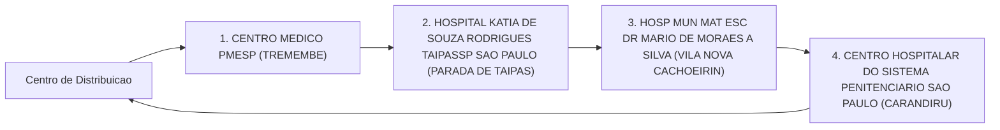
_Fluxo operacional da Rota 4._

---

# Rota 5: Entrega Hospitalar

## Resumo Operacional

| Item                      | Detalhes                     |
|---------------------------|------------------------------|
| Veículo                   | CITROEN AIRCROSS             |
| Capacidade do Veículo     | 350 kg                       |
| Autonomia                 | 395 km                       |
| Distância Total           | 112.3 km                     |
| Duração Estimada          | 165.0 min                    |
| Carga Total               | 347.9 kg                     |

## Checklist Antes da Partida

- [ ] Verificar a carga total e garantir que não exceda a capacidade do veículo.
- [ ] Conferir a documentação do veículo e das entregas.
- [ ] Checar o nível de combustível do veículo.
- [ ] Confirmar a rota e as paradas programadas.
- [ ] Garantir que todos os medicamentos estejam devidamente armazenados e identificados.
- [ ] Equipar o veículo com kit de primeiros socorros e materiais de segurança.

## Paradas Programadas

| Nº | Local de Entrega                                                    | Prioridade | Carga (kg) | Orientação                                          |
|----|--------------------------------------------------------------------|------------|------------|-----------------------------------------------------|
| 1  | HOSP MUN JOSANIAS CASTANHA BRAGA (JARDIM ROSCHEL)                 | REGULAR    | 116.8      | Entregar medicamentos e materiais hospitalares.     |
| 2  | HOSPITAL UNIVERSITARIO DA USP SAO PAULO (BUTANTA)                 | REGULAR    | 98.6       | Confirmar recebimento de medicamentos críticos.      |
| 3  | HOSP MUN GILSON DE CASSIA MARQUES DE CARVALHO (VILA MASCOTE)      | REGULAR    | 17.0       | Entregar conforme solicitação anterior.              |
| 4  | HOSP MUN JABAQUARA ARTUR RIBEIRO DE SABOYA (JABAQUARA)            | REGULAR    | 28.0       | Verificar se há necessidade de entrega emergencial.  |
| 5  | CENTRO DE REFERENCIA E TREINAMENTO DST AIDS SAO PAULO (VILA MARIANA)| REGULAR    | 87.5       | Confirmar a entrega de materiais de prevenção.      |

## Alertas de Segurança

⚠️ **Cuidado com Medicamentos**: Verifique se os medicamentos estão dentro da validade e armazenados em temperatura adequada durante o transporte.

🚨 **Entrega Crítica**: A entrega de medicamentos para o HOSPITAL UNIVERSITARIO DA USP SAO PAULO é considerada crítica. Priorizar a entrega e garantir que o recebimento seja confirmado.

## Checklist de Encerramento

- [ ] Confirmar a entrega de todos os itens nas paradas programadas.
- [ ] Coletar assinaturas de recebimento de cada hospital.
- [ ] Verificar se não há carga restante no veículo.
- [ ] Registrar qualquer incidente ou atraso durante a rota.
- [ ] Realizar a limpeza e organização do veículo após a entrega.

## Fluxo da rota

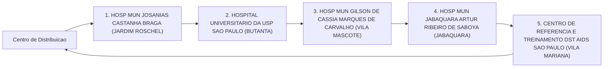
_Fluxo operacional da Rota 5._

---

# Rota 6: Entrega Hospitalar

## Resumo Operacional

| Item                        | Detalhes                 |
|-----------------------------|--------------------------|
| **Veículo**                 | VW VIRTUS                |
| **Capacidade**              | 350 kg                   |
| **Autonomia**               | 415 km                   |
| **Distância Total**         | 113.1 km                 |
| **Duração Estimada**        | 183.7 min                |
| **Carga Total**             | 278.9 kg                 |

## Checklist Antes da Partida

- [ ] Verificar a carga total (278.9 kg).
- [ ] Confirmar a capacidade do veículo (350 kg).
- [ ] Checar a autonomia do veículo (415 km).
- [ ] Garantir que todos os medicamentos estão devidamente acondicionados e identificados.
- [ ] Revisar o itinerário e as paradas programadas.
- [ ] Conferir se o veículo está em boas condições de funcionamento.

## Paradas Programadas

| Nº | Local de Entrega                                                                 | Prioridade | Carga (kg) | Orientação                          |
|----|----------------------------------------------------------------------------------|------------|------------|-------------------------------------|
| 1  | INSTITUTO DO CANCER DO ESTADO DE SAO PAULO (CERQUEIRA CESAR)                   | REGULAR    | 22.1       | Entrega regular                     |
| 2  | INSTITUTO DE REABILITACAO LUCY MONTORO (VILA ANDRADE)                          | REGULAR    | 20.0       | Entrega regular                     |
| 3  | HOSPITAL MATERNIDADE INTERLAGOS (JD LEBLON)                                     | REGULAR    | 34.1       | Entrega regular                     |
| 4  | HOSPITAL GERAL DO GRAJAU PROF LIBER JOHN ALPHONSE DI DIO SP (PARQUE DAS NACOES)| REGULAR    | 101.2      | Entrega regular                     |
| 5  | HOSP MUN TIDE SETUBAL (SAO MIGUEL PAULISTA)                                    | REGULAR    | 81.3       | Entrega regular                     |
| 6  | HOSPITAL GERAL DE SAO MATEUS SAO PAULO (SAO MATEUS)                           | REGULAR    | 20.2       | Entrega regular                     |

## Alertas de Segurança

⚠️ **Cuidados com Medicamentos**: Certifique-se de que todos os medicamentos estão armazenados em temperatura adequada e que não há risco de contaminação.

🚨 **Entrega Crítica**: Nenhuma entrega crítica identificada nesta rota.

## Checklist de Encerramento

- [ ] Confirmar a entrega de todas as cargas.
- [ ] Verificar se não houve danos aos medicamentos durante o transporte.
- [ ] Registrar qualquer incidente ou anomalia durante a entrega.
- [ ] Garantir que o veículo está limpo e em boas condições para a próxima viagem. 
- [ ] Finalizar o relatório de entrega e enviar para o setor responsável.

## Fluxo da rota

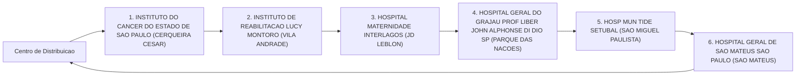
_Fluxo operacional da Rota 6._

---

# Rota 7: Entrega Hospitalar

## Resumo Operacional

| Item                     | Detalhes                  |
|--------------------------|---------------------------|
| **Veículo**              | PEUGEOT 208               |
| **Capacidade**           | 350 kg                    |
| **Autonomia**            | 415 km                    |
| **Distância Total**      | 91.8 km                   |
| **Duração Estimada**     | 152.9 min                 |
| **Carga Total**          | 315.7 kg                  |

## Checklist Antes da Partida

- [ ] Verificar a carga total (315.7 kg)
- [ ] Confirmar a autonomia do veículo (415 km)
- [ ] Checar as condições do veículo (pneus, óleo, combustível)
- [ ] Garantir que a documentação de transporte está em ordem
- [ ] Revisar a lista de entregas e prioridades

## Paradas em Ordem de Entrega

| Nº | Local de Entrega                                           | Prioridade | Carga (kg) | Orientação                          |
|----|-----------------------------------------------------------|------------|------------|-------------------------------------|
| 1  | HOSPITAL HELIOPOLIS UNIDADE DE GESTAO ASSISTENCIAL I     | REGULAR    | 81.5       | Entrega padrão                      |
| 2  | HOSP MUN SOROCABANA                                       | REGULAR    | 11.3       | Entrega padrão                      |
| 3  | CAISM PHILIPPE PINEL SAO PAULO                            | REGULAR    | 47.4       | Entrega padrão                      |
| 4  | INSTITUTO DE INFECTOLOGIA EMILIO RIBAS                   | REGULAR    | 108.1      | Entrega padrão                      |
| 5  | HOSPITAL REGIONAL SUL SAO PAULO                           | REGULAR    | 33.2       | Entrega padrão                      |
| 6  | HOSPITAL INFANTIL DARCY VARGAS UGA III SAO PAULO        | REGULAR    | 34.2       | Entrega padrão                      |

## Alertas de Segurança

⚠️ **Cuidados com Medicamentos:**
- Manter a carga em temperatura adequada durante o transporte.
- Verificar se os medicamentos estão devidamente embalados e identificados.

🚨 **Entrega Crítica:**
- Assegurar que a carga para o INSTITUTO DE INFECTOLOGIA EMILIO RIBAS (108.1 kg) seja priorizada na entrega.

## Checklist de Encerramento

- [ ] Confirmar a entrega de todas as cargas
- [ ] Coletar assinaturas de recebimento
- [ ] Verificar se não há carga restante no veículo
- [ ] Registrar qualquer incidente durante a entrega
- [ ] Realizar uma inspeção final no veículo antes de retornar

## Fluxo da rota

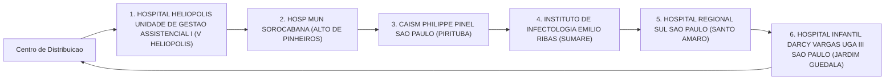
_Fluxo operacional da Rota 7._

---

# Rota 8: Entregas Hospitalares

## Resumo Operacional

| Item                     | Detalhe                         |
|--------------------------|---------------------------------|
| Veículo                  | Hyundai CRETA                   |
| Capacidade               | 350 kg                          |
| Autonomia                | 420 km                          |
| Distância Total          | 85.8 km                         |
| Duração Estimada         | 132.9 min                       |
| Carga Total              | 322.5 kg                        |

## Checklist Antes da Partida

- [ ] Verificar nível de combustível do veículo
- [ ] Conferir carga total e distribuição
- [ ] Checar documentação necessária para transporte
- [ ] Garantir que os medicamentos estejam devidamente acondicionados
- [ ] Confirmar a rota e as paradas programadas
- [ ] Realizar inspeção de segurança no veículo

## Paradas Programadas

| Nº | Local de Entrega                                           | Prioridade | Carga (kg) | Orientação                               |
|----|-----------------------------------------------------------|------------|------------|------------------------------------------|
| 1  | HOSP MUN MATERNIDADE PROFESSOR MARIO DEGNI (VILA ANTONIO) | REGULAR    | 99.0       | Entrega regular, verificar condições     |
| 2  | HOSP MUN CAPELA DO SOCORRO (JARDIM DAS IMBUIAS)         | REGULAR    | 119.6      | Entrega regular, manter carga segura     |
| 3  | HOSPITAL GERAL DE PEDREIRA (VILA CAMPO GRANDE)           | REGULAR    | 12.9       | Entrega regular, confirmar recebimento   |
| 4  | HOSPITAL MUNICIPAL GUARAPIRANGA (RIVIERA PAULISTA)      | REGULAR    | 91.0       | Entrega regular, finalizar checklist      |

## Alertas de Segurança

⚠️ **Atenção**: Verifique se os medicamentos estão em condições adequadas para transporte. 

🚨 **Entrega Crítica**: Nenhuma entrega crítica nesta rota, mas mantenha atenção redobrada com a carga de medicamentos.

## Checklist de Encerramento

- [ ] Confirmar entrega de todos os itens
- [ ] Coletar assinatura de recebimento
- [ ] Verificar se não há carga remanescente no veículo
- [ ] Realizar inspeção final do veículo
- [ ] Registrar qualquer incidente durante a entrega

✅ **Entrega Concluída**: Todas as entregas realizadas conforme planejado.

## Fluxo da rota

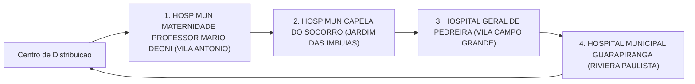
_Fluxo operacional da Rota 8._

---

# Rota 9: Entrega Hospitalar

## Resumo Operacional

| Item                     | Detalhe                      |
|--------------------------|------------------------------|
| Veículo                  | FIAT FASTBACK                |
| Capacidade do Veículo    | 350 kg                       |
| Autonomia                 | 445 km                       |
| Distância Total          | 88.7 km                      |
| Duração Estimada         | 146.1 min                    |
| Carga Total              | 295.0 kg                     |

## Checklist Antes da Partida

- [ ] Verificar a carga total (295.0 kg) e garantir que não ultrapasse a capacidade do veículo (350 kg).
- [ ] Conferir a documentação do veículo e da carga.
- [ ] Checar o nível de combustível e a autonomia do veículo (445 km).
- [ ] Confirmar a rota e as paradas programadas.
- [ ] Garantir que os medicamentos estejam devidamente armazenados e identificados.
- [ ] Equipar o veículo com materiais de segurança e primeiros socorros.

## Paradas Programadas

| Nº | Local de Entrega                                                                 | Prioridade | Carga (kg) | Orientação                        |
|----|----------------------------------------------------------------------------------|------------|------------|-----------------------------------|
| 1  | HOSPITAL GERAL DE VILA PENTEADO DR JOSE PANGELLA, SÃO PAULO (JARDIM IRACEMA)   | REGULAR    | 82.1       | Entregar no setor de emergência.  |
| 2  | HOSP DO SERV PUB MUNICIPAL HSPM, SÃO PAULO (LIBERDADE)                         | REGULAR    | 110.6      | Conferir documentação na entrada. |
| 3  | HOSP MUN PROF DR WALDOMIRO DE PAULA, SÃO PAULO (ITAQUERA)                      | REGULAR    | 51.6       | Entregar na ala de internação.    |
| 4  | HOSPITAL GERAL JESUS TEIXEIRA DA COSTA, SÃO PAULO (JARDIM SÃO PAULO)          | REGULAR    | 50.7       | Confirmar recebimento com assinatura.|

## Alertas de Segurança

⚠️ **Atenção:** Verifique se os medicamentos estão em condições adequadas para transporte e se a temperatura está controlada.

🚨 **Entrega Crítica:** Medicamentos que requerem atenção especial devem ser entregues com prioridade. 

## Checklist de Encerramento

- [ ] Confirmar a entrega de todas as cargas programadas.
- [ ] Coletar assinaturas de recebimento nos locais de entrega.
- [ ] Verificar se não há carga restante no veículo.
- [ ] Registrar qualquer incidente ou atraso durante a entrega.
- [ ] Retornar ao ponto de partida e abastecer o veículo, se necessário. 
- [ ] Realizar a limpeza e organização do veículo após a entrega. ✅

## Fluxo da rota

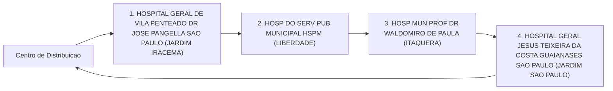
_Fluxo operacional da Rota 9._

---

# Rota 10: Entrega Hospitalar

## Resumo Operacional

| Item                       | Detalhe                     |
|----------------------------|-----------------------------|
| Veículo                    | CITROEN AIRCROSS            |
| Capacidade do Veículo      | 350 kg                      |
| Autonomia                  | 395 km                      |
| Distância Total            | 57.5 km                     |
| Duração Estimada           | 91.9 min                    |
| Carga Total                | 285.5 kg                    |

## Checklist Antes da Partida

- [ ] Verificar nível de combustível do veículo
- [ ] Conferir carga total e peso
- [ ] Checar documentação necessária
- [ ] Confirmar endereços de entrega
- [ ] Inspecionar estado do veículo (pneus, freios, etc.)
- [ ] Garantir que todos os medicamentos estão devidamente armazenados e etiquetados

## Tabela de Paradas

| Nº | Local de Entrega                                             | Prioridade | Carga (kg) | Orientação                        |
|----|------------------------------------------------------------|------------|------------|-----------------------------------|
| 1  | HOSP MUN VER JOSE STOROPOLLI (PARQUE NOVO MUNDO)          | REGULAR    | 74.3       | Entrega regular                   |
| 2  | HOSPITAL E MATERNIDADE LEONOR MENDES DE BARROS SAO PAULO  | REGULAR    | 104.8      | Entrega regular                   |
| 3  | HOSPITAL ESTADUAL DE SAPOPEMBA SAO PAULO                  | REGULAR    | 106.4      | Entrega regular                   |

## Alertas de Segurança

⚠️ **Cuidado com Medicamentos**: Assegure que os medicamentos estejam sempre em temperatura adequada e devidamente embalados para evitar danos.

🚨 **Entrega Crítica**: Esteja ciente da urgência nas entregas, especialmente em casos de medicamentos essenciais.

## Checklist de Encerramento

- [ ] Confirmar que todas as entregas foram realizadas
- [ ] Obter assinaturas de recebimento nos locais de entrega
- [ ] Verificar se não há carga restante no veículo
- [ ] Registrar qualquer incidente ou atraso durante a rota
- [ ] Retornar ao ponto de partida e realizar inspeção final do veículo

✅ **Encerramento Completo**: Todas as etapas foram concluídas com sucesso.

## Fluxo da rota

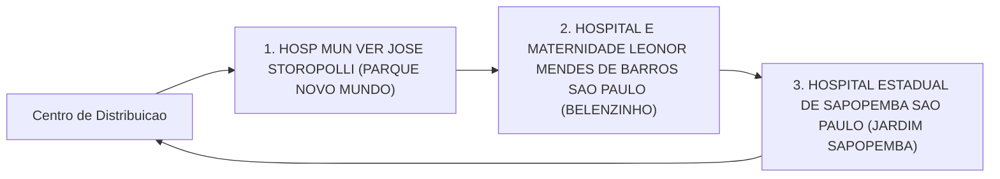
_Fluxo operacional da Rota 10._

---

# Rota 11: Entrega Hospitalar

## Resumo Operacional

| Item                      | Detalhe               |
|---------------------------|-----------------------|
| Veículo                   | VW VIRTUS             |
| Capacidade do Veículo     | 350 kg                |
| Autonomia do Veículo      | 415 km                |
| Distância Total           | 31.2 km               |
| Duração Estimada          | 58.3 min              |
| Carga Total               | 202.0 kg              |

## Checklist Antes da Partida

- [ ] Verificar se o veículo está em boas condições.
- [ ] Conferir a carga total (202.0 kg).
- [ ] Garantir que a documentação necessária está a bordo.
- [ ] Revisar o itinerário e as paradas programadas.
- [ ] Confirmar a presença de equipamentos de segurança.
- [ ] Checar se os medicamentos estão devidamente armazenados e identificados. ⚠️

## Paradas Programadas

| Nº | Local de Entrega                                          | Prioridade | Carga   | Orientação                                     |
|----|---------------------------------------------------------|------------|---------|------------------------------------------------|
| 1  | CONJUNTO HOSPITALAR DO MANDAQUI SAO PAULO (SANTANA)    | REGULAR    | 98.8 kg | Entrega regular, verificar condições de carga.  |
| 2  | UNIDADE DE GESTAO ASSISTENCIAL II HOSPITAL IPIRANGA SP  | REGULAR    | 103.2 kg| Entrega regular, confirmar recebimento.         |

## Alertas de Segurança

🚨 **Entregas Críticas**: Medicamentos devem ser manuseados com cuidado e entregues dentro do prazo para garantir a eficácia.

⚠️ **Cuidados**: Verificar a temperatura e a integridade dos medicamentos durante o transporte.

## Checklist de Encerramento

- [ ] Confirmar a entrega de todos os itens.
- [ ] Obter assinatura de recebimento em cada parada.
- [ ] Verificar se não há carga restante no veículo.
- [ ] Registrar qualquer incidente durante a entrega.
- [ ] Retornar ao ponto de partida e realizar a conferência final do veículo. ✅

## Fluxo da rota

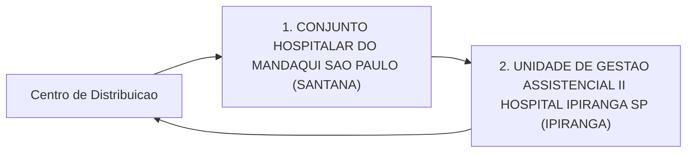
_Fluxo operacional da Rota 11._

---
