# Rota 1: Entrega Hospitalar

## Resumo Operacional

| Item                       | Detalhes                |
|----------------------------|------------------------|
| **Veículo**                | VW VIRTUS              |
| **Capacidade**             | 350 kg                 |
| **Autonomia**              | 415 km                 |
| **Distância Total**        | 169.6 km               |
| **Duração Estimada**       | 257.1 min              |
| **Carga Total**            | 298.1 kg               |

## Checklist Antes da Partida

- [ ] Verificar a carga total (298.1 kg) e garantir que não exceda a capacidade do veículo (350 kg).
- [ ] Conferir a autonomia do veículo (415 km) para garantir que é suficiente para a rota (169.6 km).
- [ ] Confirmar que todos os medicamentos estão devidamente embalados e identificados.
- [ ] Checar o estado do veículo (combustível, pneus, freios).
- [ ] Revisar a lista de paradas e prioridades.

## Paradas Programadas

| Nº | Local de Entrega                                                      | Prioridade  | Carga   | Orientação                       |
|----|----------------------------------------------------------------------|-------------|---------|----------------------------------|
| 1  | HOSP MUN FERNANDO MAURO PIRES DA ROCHA (CAMPO LIMPO)               | 🚨 CRITICAL | 39.1 kg | Entrega imediata                 |
| 2  | CENTRO DE REFERENCIA DA SAUDE DA MULHER (CAMPOS ELISEOS)           | 🚨 CRITICAL | 18.8 kg | Entrega imediata                 |
| 3  | INSTITUTO DE INFECTOLOGIA EMILIO RIBAS (SUMARE)                    | 🚨 CRITICAL | 108.1 kg| Entrega imediata                 |
| 4  | HOSP MUN INFANTIL MENINO JESUS (BELA VISTA)                         | 🚨 CRITICAL | 21.1 kg | Entrega imediata                 |
| 5  | CAISM PHILIPPE PINEL SAO PAULO (PIRITUBA)                          | 🚨 CRITICAL | 47.4 kg | Entrega imediata                 |
| 6  | HOSPITAL GERAL DE PEDREIRA (VILA CAMPO GRANDE)                     | 🚨 CRITICAL | 12.9 kg | Entrega imediata                 |
| 7  | HOSPITAL GERAL JESUS TEIXEIRA DA COSTA GUAIANASES SAO PAULO (JARDIM SAO PAULO) | 🚨 CRITICAL | 50.7 kg | Entrega imediata                 |

## Alertas de Segurança

- ⚠️ **Medicamentos**: Manter a carga em temperatura controlada durante o transporte.
- ⚠️ **Condução**: Evitar paradas desnecessárias e dirigir com cautela para garantir a integridade da carga.

## Checklist de Encerramento

- [ ] Confirmar que todas as entregas foram realizadas.
- [ ] Verificar se a carga foi descarregada corretamente em cada local.
- [ ] Registrar qualquer incidente ou atraso durante a rota.
- [ ] Realizar a limpeza e organização do veículo após a entrega. 
- [ ] Reportar a conclusão da rota para a equipe de logística. ✅

## Fluxo da rota

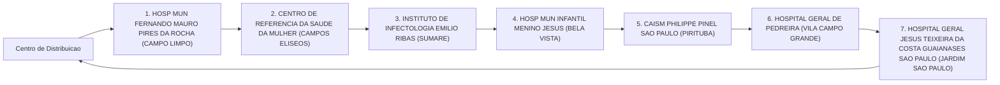
_Fluxo operacional da Rota 1._

---

# Rota 2: Entrega Hospitalar

## Resumo Operacional

| Item                          | Detalhe                       |
|-------------------------------|-------------------------------|
| **Veículo**                   | PEUGEOT 208                   |
| **Capacidade**                | 350 kg                        |
| **Autonomia**                 | 415 km                        |
| **Distância Total**           | 75.4 km                       |
| **Duração Estimada**          | 114.8 min                     |
| **Carga Total**               | 349.9 kg                      |

## Checklist Antes da Partida

- [ ] Verificar nível de combustível do veículo
- [ ] Conferir a carga total e seu peso
- [ ] Checar condições do veículo (pneus, freios, etc.)
- [ ] Garantir que todos os medicamentos estão devidamente armazenados
- [ ] Revisar a rota e condições de tráfego
- [ ] Confirmar a documentação necessária para as entregas

## Paradas Programadas

| Nº | Local de Entrega                                                        | Prioridade | Carga (kg) | Orientação                                   |
|----|-------------------------------------------------------------------------|------------|-------------|----------------------------------------------|
| 1  | CENTRO HOSPITALAR DO SISTEMA PENITENCIARIO SAO PAULO (CARANDIRU)      | 🚨 CRITICAL | 71.8       | Entrega prioritária, verificar segurança     |
| 2  | HOSP MUN MATERNIDADE PROFESSOR MARIO DEGNI (VILA ANTONIO)              | 🚨 CRITICAL | 99.0       | Entrega prioritária, medicamentos sensíveis  |
| 3  | HOSP MUN IGNACIO PROENCA DE GOUVEA (PARQUE DA MOOCA)                  | 🚨 CRITICAL | 35.2       | Entrega prioritária, verificar condições      |
| 4  | HOSPITAL DO SERV PUB EST FCO MORATO DE OLIVEIRA SAO PAULO (IBIRAPUERA) | 🚨 CRITICAL | 56.4       | Entrega prioritária, manter temperatura       |
| 5  | CENTRO DE REFERENCIA E TREINAMENTO DST AIDS SAO PAULO (VILA MARIANA)   | 🚨 CRITICAL | 87.5       | Entrega prioritária, verificar armazenamento  |

## Alertas de Segurança

- ⚠️ **Cuidado com a carga de medicamentos**: Manter a temperatura adequada durante o transporte.
- ⚠️ **Prioridade nas entregas**: Seguir a ordem de paradas para garantir a eficácia do atendimento.

## Checklist de Encerramento

- [ ] Confirmar a entrega de todas as cargas
- [ ] Coletar assinaturas de recebimento
- [ ] Verificar se não há materiais esquecidos no veículo
- [ ] Relatar qualquer incidente ou atraso durante a entrega
- [ ] Registrar a quilometragem final e o nível de combustível após a entrega

## Fluxo da rota

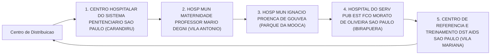
_Fluxo operacional da Rota 2._

---

# Rota 3: Entregas Hospitalares

## Resumo Operacional

| Item                       | Detalhes                    |
|----------------------------|-----------------------------|
| **Veículo**                | Hyundai CRETA               |
| **Capacidade**             | 350 kg                      |
| **Autonomia**              | 420 km                      |
| **Distância Total**        | 203.8 km                    |
| **Duração Estimada**       | 266.9 min                   |
| **Carga Total**            | 323.2 kg                    |

## Checklist Antes da Partida

- [ ] Verificar a carga total e garantir que não exceda a capacidade do veículo.
- [ ] Conferir a documentação necessária para transporte.
- [ ] Checar o estado do veículo (combustível, pneus, freios).
- [ ] Garantir que os medicamentos estejam devidamente acondicionados e identificados.
- [ ] Revisar o itinerário e as paradas programadas.

## Paradas Programadas

| Nº | Local de Entrega                                         | Prioridade | Carga  | Orientação                                    |
|----|---------------------------------------------------------|------------|--------|-----------------------------------------------|
| 1  | INSTITUTO DE REABILITACAO LUCY MONTORO (VILA ANDRADE) | 🚨 CRITICAL | 20.0 kg | Entrega prioritária, verificar urgência.     |
| 2  | HOSPITAL GERAL DE SAO MATEUS (SAO MATEUS)              | 🚨 CRITICAL | 20.2 kg | Entrega prioritária, verificar urgência.     |
| 3  | HOSPITAL MUNICIPAL BRASILANDIA (JARDIM MARISTELA)      | 🚨 CRITICAL | 40.3 kg | Entrega prioritária, verificar urgência.     |
| 4  | HOSPITAL MILITAR DE AREA DE SAO PAULO (CAMBUCI)        | 🚨 CRITICAL | 35.1 kg | Entrega prioritária, verificar urgência.     |
| 5  | CENTRO MEDICO PMESP (TREMEMBE)                         | 🚨 CRITICAL | 53.9 kg | Entrega prioritária, verificar urgência.     |
| 6  | HOSPITAL MATERNIDADE INTERLAGOS (JD LEBLON)            | REGULAR    | 34.1 kg | Entrega regular, seguir cronograma.          |
| 7  | HOSP MUN CAPELA DO SOCORRO (JARDIM DAS IMBUIAS)       | REGULAR    | 119.6 kg| Entrega regular, seguir cronograma.          |

## Alertas de Segurança

- ⚠️ **Medicamentos Críticos**: Garantir que os medicamentos estejam sempre em temperatura adequada e em local seguro durante o transporte.
- ⚠️ **Condições de Trânsito**: Ficar atento a possíveis congestionamentos ou desvios na rota.

## Checklist de Encerramento

- [ ] Confirmar a entrega de todas as cargas.
- [ ] Obter assinaturas de recebimento nos locais de entrega.
- [ ] Verificar se há cargas remanescentes no veículo.
- [ ] Registrar qualquer incidente ou atraso durante a rota.
- [ ] Realizar a limpeza e manutenção do veículo após a entrega.

## Fluxo da rota

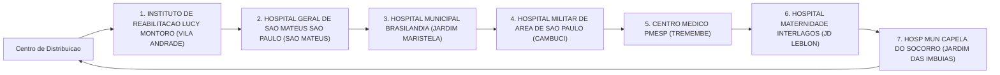
_Fluxo operacional da Rota 3._

---

# Rota 4: Entrega Hospitalar

## Resumo Operacional

| Item                      | Detalhes                       |
|---------------------------|-------------------------------|
| **Veículo**               | FIAT FASTBACK                  |
| **Capacidade**            | 350 kg                        |
| **Autonomia**             | 445 km                        |
| **Distância Total**       | 89.5 km                       |
| **Duração Estimada**      | 131.6 min                     |
| **Carga Total**           | 344.8 kg                      |

## Checklist Antes da Partida

- [ ] Verificar a carga total (344.8 kg) e garantir que não exceda a capacidade do veículo.
- [ ] Conferir a documentação do veículo e das entregas.
- [ ] Checar o nível de combustível para garantir autonomia suficiente.
- [ ] Inspecionar o veículo para garantir que está em boas condições de operação.
- [ ] Confirmar a rota e as paradas programadas.

## Tabela de Paradas

| Nº | Local de Entrega                                               | Prioridade | Carga   | Orientação                          |
|----|---------------------------------------------------------------|------------|---------|-------------------------------------|
| 1  | CONJUNTO HOSPITALAR DO MANDAQUI, SÃO PAULO (SANTANA)         | REGULAR    | 98.8 kg | Entrega normal                      |
| 2  | HOSPITAL UNIVERSITÁRIO DA USP, SÃO PAULO (BUTANTÃ)          | REGULAR    | 98.6 kg | Entrega normal                      |
| 3  | HOSPITAL INFANTIL CÂNDIDO FONTURA, SÃO PAULO (ÁGUA RASA)    | 🚨 CRITICAL| 44.7 kg | **Entrega crítica - prioridade alta** |
| 4  | HOSPITAL MUNICIPAL DR. BENEDITO MONTENEGRO, JARDIM IVA     | REGULAR    | 102.7 kg| Entrega normal                      |

## Alertas de Segurança

- ⚠️ **Cuidado com medicamentos**: Verifique a temperatura e as condições de transporte para garantir a integridade dos medicamentos.
- ⚠️ **Prioridade nas entregas críticas**: A entrega para o HOSPITAL INFANTIL CÂNDIDO FONTURA deve ser realizada o mais rápido possível.

## Checklist de Encerramento

- [ ] Confirmar a entrega de todos os itens.
- [ ] Coletar assinaturas de recebimento nos locais de entrega.
- [ ] Registrar qualquer incidente ou atraso durante a rota.
- [ ] Verificar o estado do veículo após as entregas.
- [ ] Atualizar o status das entregas no sistema.

## Fluxo da rota

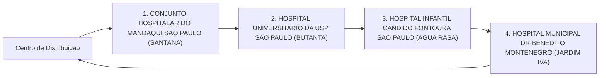
_Fluxo operacional da Rota 4._

---

# Rota 5: Entrega Hospitalar

## Resumo Operacional

| Item                  | Detalhe                         |
|-----------------------|---------------------------------|
| **Veículo**           | CITROEN AIRCROSS                |
| **Capacidade**        | 350 kg                          |
| **Autonomia**         | 395 km                          |
| **Distância Total**   | 111.4 km                        |
| **Duração Estimada**  | 150.6 min                       |
| **Carga Total**       | 289.9 kg                        |

## Checklist Antes da Partida

- [ ] Verificar nível de combustível do veículo
- [ ] Conferir carga total e peso
- [ ] Checar documentação do veículo
- [ ] Garantir que todos os medicamentos estão devidamente armazenados
- [ ] Confirmar que o equipamento de segurança está a bordo (extintor, kit de primeiros socorros)
- [ ] Revisar o itinerário e as paradas programadas

## Paradas Programadas

| Nº | Local de Entrega                                                          | Prioridade | Carga (kg) | Orientação                                     |
|----|--------------------------------------------------------------------------|------------|------------|------------------------------------------------|
| 1  | HOSPITAL MUNICIPAL GUARAPIRANGA (RIVIERA PAULISTA)                     | REGULAR    | 91.0       | Entregar medicamentos e insumos hospitalares.  |
| 2  | HOSP MUN JOSANIAS CASTANHA BRAGA (JARDIM ROSCHEL)                      | REGULAR    | 116.8      | Conferir validade dos medicamentos.            |
| 3  | HOSPITAL GERAL DE VILA PENTEADO DR JOSE PANGELLA SAO PAULO (JARDIM IRACEMA) | REGULAR    | 82.1       | Garantir que a entrega seja feita no setor correto. |

## Alertas de Segurança

⚠️ **Cuidado com medicamentos**: Verifique sempre a temperatura e a integridade dos medicamentos durante o transporte.

🚨 **Entrega Crítica**: As entregas devem ser realizadas no horário estipulado para garantir a eficácia dos tratamentos.

## Checklist de Encerramento

- [ ] Confirmar entrega de todos os itens
- [ ] Coletar assinaturas de recebimento nos hospitais
- [ ] Verificar se não há carga restante no veículo
- [ ] Registrar qualquer incidente ou atraso durante a entrega
- [ ] Retornar ao ponto de partida e realizar a conferência final do veículo

✅ **Entrega Concluída**: Todas as paradas realizadas com sucesso.

## Fluxo da rota

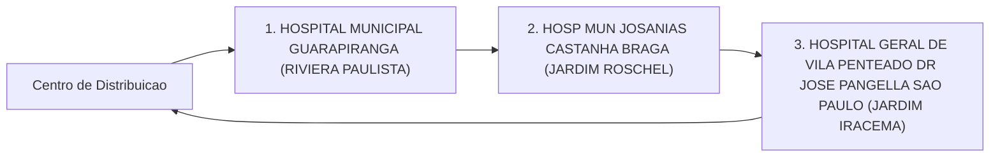
_Fluxo operacional da Rota 5._

---

# Rota 6: Entrega Hospitalar

## Resumo Operacional

| Item                       | Detalhes                |
|----------------------------|-------------------------|
| Veículo                    | VW VIRTUS               |
| Capacidade                 | 350 kg                  |
| Autonomia                  | 415 km                  |
| Distância Total            | 63.8 km                 |
| Duração Estimada           | 89.8 min                |
| Carga Total                | 290.2 kg                |

## Checklist Antes da Partida

- [ ] Verificar a carga total (290.2 kg) e garantir que não excede a capacidade do veículo (350 kg).
- [ ] Confirmar a autonomia do veículo (415 km) é suficiente para a distância total (63.8 km).
- [ ] Checar se todos os medicamentos estão devidamente armazenados e identificados.
- [ ] Garantir que o veículo está em boas condições de funcionamento.
- [ ] Revisar o itinerário e as paradas programadas.

## Paradas Programadas

| Nº | Local de Entrega                                               | Prioridade | Carga   | Orientação                          |
|----|---------------------------------------------------------------|------------|---------|-------------------------------------|
| 1  | HOSP MUN VER JOSE STOROPOLLI (PARQUE NOVO MUNDO)             | REGULAR    | 74.3 kg | Entregar na recepção do hospital.   |
| 2  | HOSP MUN SOROCABANA (VILA ROMANA)                             | REGULAR    | 97.1 kg | Verificar assinatura na entrega.    |
| 3  | HOSPITAL KATIA DE SOUZA RODRIGUES TAIPASSP SAO PAULO       | REGULAR    | 118.8 kg| Conferir documentação necessária.   |

## Alertas de Segurança

⚠️ **Cuidado com medicamentos**: Manter a carga em temperatura adequada e evitar exposição ao sol.

🚨 **Entrega Crítica**: Todas as entregas são importantes, mas atenção especial deve ser dada ao transporte de medicamentos.

## Checklist de Encerramento

- [ ] Confirmar a entrega de todas as cargas nas paradas programadas.
- [ ] Coletar assinaturas de recebimento nos locais de entrega.
- [ ] Verificar se não há itens esquecidos no veículo.
- [ ] Registrar qualquer incidente ou anomalia durante a entrega.
- [ ] Garantir que o veículo está limpo e pronto para a próxima operação. ✅

## Fluxo da rota

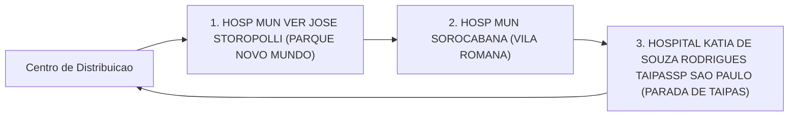
_Fluxo operacional da Rota 6._

---

# Rota 7: Entrega Hospitalar

## Resumo Operacional

| Item                     | Detalhes                      |
|--------------------------|-------------------------------|
| Veículo                  | PEUGEOT 208                   |
| Capacidade               | 350 kg                        |
| Autonomia                | 415 km                        |
| Distância Total          | 141.2 km                      |
| Duração Estimada         | 201.3 min                     |
| Carga Total              | 326.6 kg                      |

## Checklist Antes da Partida

- [ ] Verificar nível de combustível do veículo.
- [ ] Conferir a carga total e garantir que não ultrapasse a capacidade do veículo.
- [ ] Checar a documentação necessária para transporte.
- [ ] Confirmar as condições de segurança do veículo.
- [ ] Garantir que todos os medicamentos estejam devidamente armazenados e identificados.
- [ ] Revisar o itinerário e as paradas programadas.

## Paradas Programadas

| Nº | Local de Entrega                                                                 | Prioridade | Carga (kg) | Orientação                   |
|----|----------------------------------------------------------------------------------|------------|------------|------------------------------|
| 1  | HOSP MUN CARMEN PRUDENTE (CIDADE TIRADENTES)                                   | REGULAR    | 119.7      | Entregar primeiro            |
| 2  | HOSP MUN PROFESSOR DOUTOR ALIPIO CORREA NETTO (VILA PARANAGUA)                | REGULAR    | 71.3       | Entregar segundo             |
| 3  | HOSP MUN DR CARMINO CARICCHIO (TATUAPE)                                       | REGULAR    | 39.4       | Entregar terceiro            |
| 4  | HOSP MUN V NHOCUNE ALEXANDRE ZAIO (VILA NHOCUNE)                              | REGULAR    | 28.8       | Entregar quarto              |
| 5  | HOSPITAL INFANTIL DARCY VARGAS UGA III SAO PAULO (JARDIM GUEDALA)            | REGULAR    | 34.2       | Entregar quinto              |
| 6  | HOSPITAL REGIONAL SUL SAO PAULO (SANTO AMARO)                                 | REGULAR    | 33.2       | Entregar último              |

## Alertas de Segurança

⚠️ **Atenção:** Verifique se os medicamentos estão em condições adequadas de transporte e se a temperatura está controlada, se necessário.

🚨 **Entrega Crítica:** Assegure-se de que a entrega dos medicamentos para o HOSPITAL INFANTIL DARCY VARGAS seja feita com prioridade e cuidado.

## Checklist de Encerramento

- [ ] Confirmar a entrega de todos os itens na lista de paradas.
- [ ] Coletar assinaturas de recebimento nos locais de entrega.
- [ ] Verificar se há carga restante no veículo.
- [ ] Reportar qualquer incidente ou atraso durante o percurso.
- [ ] Realizar uma inspeção final no veículo antes de retornar.

## Fluxo da rota

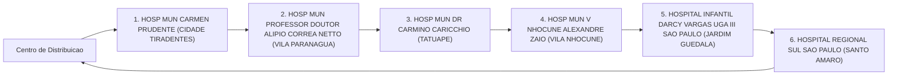
_Fluxo operacional da Rota 7._

---

# Rota 8: Entrega Hospitalar

## Resumo Operacional

| Item                     | Detalhes                  |
|--------------------------|---------------------------|
| **Veículo**              | Hyundai CRETA             |
| **Capacidade**           | 350 kg                    |
| **Autonomia**            | 420 km                    |
| **Distância Total**      | 77.1 km                   |
| **Duração Estimada**     | 117.9 min                 |
| **Carga Total**          | 296.4 kg                  |

## Checklist Antes da Partida

- [ ] Verificar a carga total (296.4 kg) e garantir que não exceda a capacidade do veículo (350 kg).
- [ ] Confirmar a autonomia do veículo (420 km) é suficiente para a distância total (77.1 km).
- [ ] Checar a documentação necessária para transporte de cargas hospitalares.
- [ ] Garantir que todos os medicamentos e materiais estejam devidamente embalados e identificados.
- [ ] Revisar o itinerário e as paradas programadas.

## Tabela de Paradas

| Nº | Local de Entrega                                                                 | Prioridade | Carga (kg) | Orientação                                    |
|----|----------------------------------------------------------------------------------|------------|-------------|-----------------------------------------------|
| 1  | HOSPITAL GERAL HENRIQUE ALTIMEYER DE VILA ALPINA                               | REGULAR    | 115.3       | Entrega regular, verificar condições de recebimento. |
| 2  | HOSPITAL GERAL DO GRAJAU PROF LIBER JOHN ALPHONSE DI DIO SP                   | REGULAR    | 101.2       | Entrega regular, confirmar horário de recebimento.   |
| 3  | HOSP MUN MAT ESC DR MARIO DE MORAES A SILVA                                    | REGULAR    | 79.9        | Entrega regular, garantir que todos os itens estejam disponíveis. |

## Alertas de Segurança

⚠️ **Entrega Crítica:** Verificar a integridade dos medicamentos durante o transporte.  
⚠️ **Cuidados com Medicamentos:** Manter a temperatura adequada e evitar exposição a luz direta.

## Checklist de Encerramento

- [ ] Confirmar a entrega de todos os itens nas paradas programadas.
- [ ] Obter assinaturas de recebimento nos documentos de entrega.
- [ ] Verificar se não há carga restante no veículo.
- [ ] Registrar qualquer incidente ou anomalia durante a entrega.
- [ ] Realizar a limpeza e organização do veículo após a entrega. ✅

## Fluxo da rota

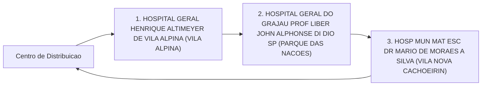
_Fluxo operacional da Rota 8._

---

# Rota 9: Entrega Hospitalar

## Resumo Operacional

| Item                       | Detalhes                     |
|----------------------------|------------------------------|
| Veículo                    | FIAT FASTBACK                |
| Capacidade do Veículo      | 350 kg                       |
| Autonomia                  | 445 km                       |
| Distância Total            | 80.9 km                      |
| Duração Estimada           | 140.3 min                    |
| Carga Total                | 347.3 kg                     |

## Checklist Antes da Partida

- [ ] Verificar a carga total (347.3 kg) e a capacidade do veículo (350 kg).
- [ ] Confirmar a autonomia do veículo (445 km) em relação à distância total (80.9 km).
- [ ] Checar se todos os medicamentos estão devidamente acondicionados e rotulados.
- [ ] Garantir que a documentação necessária para as entregas está a bordo.
- [ ] Realizar inspeção de segurança no veículo (freios, pneus, luzes).

## Paradas Programadas

| Nº | Local de Entrega                                               | Prioridade | Carga   | Orientação                          |
|----|---------------------------------------------------------------|------------|---------|-------------------------------------|
| 1  | HOSP DO SERV PUB MUNICIPAL HSPM (LIBERDADE)                  | REGULAR    | 110.6 kg| Entregar medicamentos críticos 🚨    |
| 2  | HOSP MUN GILSON DE CASSIA MARQUES DE CARVALHO (VILA MASCOTE) | REGULAR    | 17.0 kg | Verificar recebimento de materiais   |
| 3  | HOSPITAL HELIOPOLIS UNIDADE DE GESTAO ASSISTENCIAL I (V HELIOPOLIS) | REGULAR | 81.5 kg | Confirmar entrega de medicamentos    |
| 4  | HOSP MUN SOROCABANA (ALTO DE PINHEIROS)                       | REGULAR    | 11.3 kg | Entregar conforme protocolo          |
| 5  | INSTITUTO DO CANCER DO ESTADO DE SAO PAULO (CERQUEIRA CESAR) | REGULAR    | 22.1 kg | Confirmar recebimento                |
| 6  | HOSPITAL E MATERNIDADE LEONOR MENDES DE BARROS SAO PAULO (BELENZINHO) | REGULAR | 104.8 kg| Entregar medicamentos críticos 🚨    |

## Alertas de Segurança

- ⚠️ **Cuidado com medicamentos**: Verifique a temperatura e o acondicionamento dos medicamentos durante o transporte.
- ⚠️ **Condições de Trânsito**: Esteja atento a possíveis congestionamentos e rotas alternativas.

## Checklist de Encerramento

- [ ] Confirmar que todas as entregas foram realizadas conforme o planejado.
- [ ] Coletar assinaturas de recebimento nos documentos de entrega.
- [ ] Verificar se restaram cargas no veículo.
- [ ] Realizar uma inspeção final no veículo antes de retornar.
- [ ] Reportar qualquer incidente ou anomalia durante a rota. ✅

## Fluxo da rota

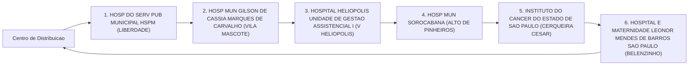
_Fluxo operacional da Rota 9._

---

# Rota 10: Entrega Hospitalar

## Resumo Operacional

| Item                      | Detalhes                     |
|---------------------------|------------------------------|
| **Veículo**               | CITROEN AIRCROSS             |
| **Capacidade**            | 350 kg                       |
| **Autonomia**             | 395 km                       |
| **Distância Total**       | 105.0 km                     |
| **Duração Estimada**      | 152.9 min                    |
| **Carga Total**           | 308.3 kg                     |

## Checklist Antes da Partida

- [ ] Verificar nível de combustível do veículo
- [ ] Conferir a carga total e distribuição
- [ ] Checar condições de segurança do veículo
- [ ] Confirmar a documentação necessária para transporte
- [ ] Revisar a lista de entregas e prioridades

## Paradas Programadas

| Nº | Local de Entrega                                             | Prioridade | Carga (kg) | Orientação                        |
|----|------------------------------------------------------------|------------|------------|-----------------------------------|
| 1  | HOSP MUN TIDE SETUBAL (SAO MIGUEL PAULISTA)               | REGULAR    | 81.3       | Entregar na recepção do hospital  |
| 2  | HOSPITAL ESTADUAL DE SAPOPEMBA SAO PAULO (JARDIM SAPOPEMBA) | REGULAR    | 106.4      | Conferir assinatura no recebimento |
| 3  | HOSPITAL GERAL SANTA MARCELINA DE ITAIM PAULISTA SAO PAULO | REGULAR    | 69.0       | Entregar diretamente ao enfermeiro |
| 4  | HOSP MUN PROF DR WALDOMIRO DE PAULA (ITAQUERA)            | REGULAR    | 51.6       | Seguir protocolo de entrega       |

## Alertas de Segurança

⚠️ **Cuidados com Medicamentos**: Manter a carga em temperatura adequada e evitar exposição ao sol.

🚨 **Entrega Crítica**: Todas as entregas são essenciais para o funcionamento hospitalar. Priorizar a pontualidade.

## Checklist de Encerramento

- [ ] Confirmar entrega de todos os itens
- [ ] Obter assinaturas de recebimento
- [ ] Verificar se não há carga remanescente no veículo
- [ ] Reportar qualquer incidente durante a entrega
- [ ] Registrar a conclusão da rota e retornar ao ponto de origem

## Fluxo da rota

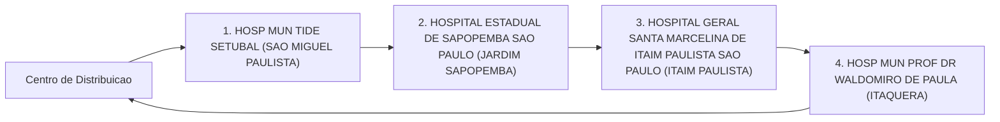
_Fluxo operacional da Rota 10._

---

# Rota 11: Entrega Hospitalar

## Resumo Operacional

| Item                     | Detalhes                     |
|--------------------------|------------------------------|
| **Veículo**              | VW VIRTUS                    |
| **Capacidade**           | 350 kg                       |
| **Autonomia**            | 415 km                       |
| **Distância Total**      | 30.8 km                      |
| **Duração Estimada**     | 57.1 min                     |
| **Carga Total**          | 131.2 kg                     |

## Checklist Antes da Partida

- [ ] Verificar nível de combustível do veículo
- [ ] Conferir carga total e peso
- [ ] Garantir que todos os medicamentos estão devidamente acondicionados
- [ ] Checar documentação necessária para transporte
- [ ] Confirmar rota e paradas
- [ ] Equipar veículo com kit de primeiros socorros

## Paradas Programadas

| Nº | Local de Entrega                                                            | Prioridade | Carga   | Orientação                       |
|----|----------------------------------------------------------------------------|------------|---------|----------------------------------|
| 1  | UNIDADE DE GESTAO ASSISTENCIAL II HOSPITAL IPIRANGA SP (IPIRANGA)         | REGULAR    | 103.2 kg| Entrega regular, verificar medicamentos 🚨 |
| 2  | HOSP MUN JABAQUARA ARTUR RIBEIRO DE SABOYA (JABAQUARA)                    | REGULAR    | 28.0 kg | Entrega regular                  |

## Alertas de Segurança

⚠️ **Cuidados com Medicamentos:**
- Manter medicamentos em temperatura adequada.
- Evitar exposição à luz direta.
- Conferir validade dos medicamentos antes do transporte.

## Checklist de Encerramento

- [ ] Confirmar entrega em ambos os locais
- [ ] Coletar assinaturas de recebimento
- [ ] Verificar se a carga foi completamente descarregada
- [ ] Registrar qualquer incidente ou anomalia durante o transporte
- [ ] Retornar ao ponto de partida e realizar inspeção final do veículo ✅

## Fluxo da rota

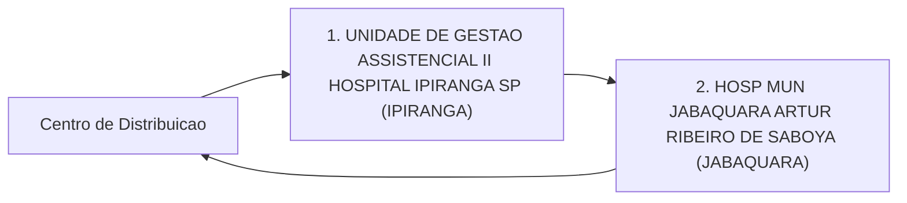
_Fluxo operacional da Rota 11._

---
