# Rota 1: Entregas Hospitalares

## Resumo Operacional

| Item                     | Detalhes                          |
|--------------------------|-----------------------------------|
| **Veículo**              | VW VIRTUS                         |
| **Capacidade**           | 350 kg                            |
| **Autonomia**            | 415 km                            |
| **Distância Total**      | 102.2 km                          |
| **Duração Estimada**     | 165.8 min                         |
| **Carga Total**          | 335.0 kg                          |

## Checklist Antes da Partida

- [ ] Verificar nível de combustível do veículo
- [ ] Conferir carga total (335.0 kg)
- [ ] Checar documentação do veículo
- [ ] Garantir que todos os medicamentos estejam devidamente acondicionados
- [ ] Confirmar rota e paradas
- [ ] Equipar o veículo com kit de primeiros socorros

## Paradas Programadas

| Nº | Local de Entrega                                                               | Prioridade | Carga (kg) | Orientação                                     |
|----|-------------------------------------------------------------------------------|------------|------------|------------------------------------------------|
| 1  | HOSP MUN V NHOCUNE ALEXANDRE ZAIO (VILA NHOCUNE)                             | REGULAR    | 28.8       | Entregar na recepção do hospital               |
| 2  | HOSPITAL MUNICIPAL DR BENEDITO MONTENEGRO (JARDIM IVA)                      | REGULAR    | 102.7      | Conferir assinatura do responsável na entrega  |
| 3  | HOSP MUN CARMEN PRUDENTE (CIDADE TIRADENTES)                                 | REGULAR    | 119.7      | Aguardar confirmação de recebimento             |
| 4  | HOSPITAL INFANTIL CANDIDO FONTOURA SAO PAULO (AGUA RASA)                    | REGULAR    | 44.7       | Entregar na ala pediátrica                     |
| 5  | HOSP MUN FERNANDO MAURO PIRES DA ROCHA (CAMPO LIMPO)                        | REGULAR    | 39.1       | Verificar se há necessidade de resfriamento    |

## Alertas de Segurança

⚠️ **Cuidados com Medicamentos**: Assegure-se de que os medicamentos estejam em temperatura adequada durante o transporte. 

🚨 **Entregas Críticas**: Mantenha atenção redobrada nas entregas que envolvem medicamentos essenciais.

## Checklist de Encerramento

- [ ] Confirmar entrega de todos os itens
- [ ] Coletar assinaturas de recebimento
- [ ] Verificar se não há carga restante no veículo
- [ ] Registrar qualquer incidente ou atraso
- [ ] Retornar ao ponto de partida e entregar a documentação necessária

## Fluxo da rota

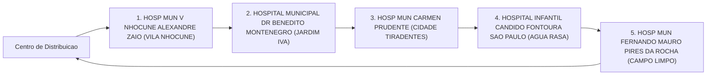
_Fluxo operacional da Rota 1._

---

# Rota 2: Entrega Hospitalar

## Resumo Operacional

| Item                     | Detalhe                      |
|--------------------------|------------------------------|
| Veículo                  | PEUGEOT 208                  |
| Capacidade               | 350 kg                       |
| Autonomia                | 415 km                       |
| Distância Total          | 82.1 km                      |
| Duração Estimada         | 127.4 min                    |
| Carga Total              | 295.0 kg                     |

## Checklist Antes da Partida
- [ ] Verificar a carga total (295.0 kg) e a capacidade do veículo (350 kg).
- [ ] Confirmar a autonomia do veículo (415 km) em relação à distância total (82.1 km).
- [ ] Checar os documentos do veículo e da carga.
- [ ] Garantir que todos os medicamentos estejam devidamente armazenados e identificados.
- [ ] Realizar inspeção de segurança no veículo.
- [ ] Confirmar o itinerário e as paradas programadas.

## Paradas Programadas

| Nº | Local de Entrega                                                        | Prioridade | Carga   | Orientação                                       |
|----|-------------------------------------------------------------------------|------------|---------|--------------------------------------------------|
| 1  | HOSPITAL GERAL HENRIQUE ALTIMEYER DE VILA ALPINA                       | REGULAR    | 115.3 kg| Entregar no setor de emergência.                 |
| 2  | HOSP MUN PROFESSOR DOUTOR ALIPIO CORREA NETTO                          | REGULAR    | 71.3 kg | Entregar no setor de internação.                 |
| 3  | HOSPITAL GERAL SANTA MARCELINA DE ITAIM PAULISTA SAO PAULO            | REGULAR    | 69.0 kg | Entregar no centro cirúrgico.                    |
| 4  | HOSP MUN DR CARMINO CARICCHIO                                          | REGULAR    | 39.4 kg | Entregar no setor de pediatria.                  |

## Alertas de Segurança
⚠️ **Cuidado com medicamentos**: Verifique a temperatura e a integridade dos medicamentos durante o transporte.  
🚨 **Entrega Crítica**: As entregas devem ser realizadas dentro do prazo para garantir a eficácia dos tratamentos.

## Checklist de Encerramento
- [ ] Confirmar a entrega de todas as cargas.
- [ ] Coletar assinaturas de recebimento nos locais de entrega.
- [ ] Realizar uma verificação final no veículo.
- [ ] Registrar qualquer incidente ou atraso durante a rota.
- [ ] Informar a central sobre a conclusão da entrega. ✅

## Fluxo da rota

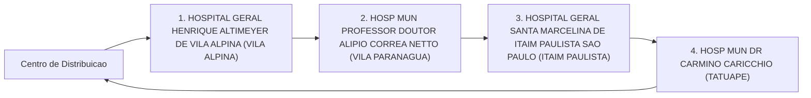
_Fluxo operacional da Rota 2._

---

# Rota 3: Entrega Hospitalar

## Resumo Operacional

| Item                     | Detalhes                      |
|--------------------------|-------------------------------|
| **Veículo**              | Hyundai CRETA                 |
| **Capacidade**           | 350 kg                        |
| **Autonomia**            | 420 km                        |
| **Distância Total**      | 64.0 km                       |
| **Duração Estimada**     | 112.5 min                     |
| **Carga Total**          | 304.0 kg                      |

## Checklist Antes da Partida
- [ ] Verificar nível de combustível do veículo
- [ ] Conferir carga total e distribuição no veículo
- [ ] Checar documentação necessária para transporte
- [ ] Garantir que todos os medicamentos estejam devidamente armazenados
- [ ] Revisar rota e condições de tráfego
- [ ] Equipamentos de segurança (cinto de segurança, triângulo, etc.) prontos

## Paradas Programadas

| Nº | Local de Entrega                                             | Prioridade | Carga   | Orientação                       |
|----|------------------------------------------------------------|------------|---------|----------------------------------|
| 1  | HOSPITAL DO SERV PUB EST FCO MORATO DE OLIVEIRA SAO PAULO | REGULAR    | 56.4 kg | Entrega regular                  |
| 2  | HOSP MUN IGNACIO PROENCA DE GOUVEA                        | REGULAR    | 35.2 kg | Entrega regular                  |
| 3  | HOSP MUN INFANTIL MENINO JESUS                             | REGULAR    | 21.1 kg | Entrega regular                  |
| 4  | HOSPITAL MILITAR DE AREA DE SAO PAULO                      | REGULAR    | 35.1 kg | Entrega regular                  |
| 5  | CENTRO DE REFERENCIA DA SAUDE DA MULHER                    | REGULAR    | 18.8 kg | Entrega regular                  |
| 6  | HOSPITAL MUNICIPAL BRASILANDIA                             | REGULAR    | 40.3 kg | Entrega regular                  |
| 7  | HOSP MUN SOROCABANA                                       | REGULAR    | 97.1 kg | Entrega regular                  |

## Alertas de Segurança
⚠️ **Cuidados com Medicamentos**: Verifique a temperatura e a integridade dos medicamentos durante o transporte. 

🚨 **Entrega Crítica**: Nenhuma entrega crítica nesta rota, mas mantenha atenção redobrada.

## Checklist de Encerramento
- [ ] Conferir se todas as entregas foram realizadas
- [ ] Verificar se a carga foi descarregada corretamente
- [ ] Registrar qualquer incidente ou problema durante a rota
- [ ] Garantir que o veículo esteja em boas condições para a próxima viagem
- [ ] Reportar ao supervisor sobre a conclusão da rota

## Fluxo da rota

```mermaid
flowchart LR
    deposito["Centro de Distribuicao"]
    parada_1["1. HOSPITAL DO SERV PUB EST FCO MORATO DE OLIVEIRA SAO PAULO (IBIRAPUERA)"]
    deposito --> parada_1
    parada_2["2. HOSP MUN IGNACIO PROENCA DE GOUVEA (PARQUE DA MOOCA)"]
    parada_1 --> parada_2
    parada_3["3. HOSP MUN INFANTIL MENINO JESUS (BELA VISTA)"]
    parada_2 --> parada_3
    parada_4["4. HOSPITAL MILITAR DE AREA DE SAO PAULO (CAMBUCI)"]
    parada_3 --> parada_4
    parada_5["5. CENTRO DE REFERENCIA DA SAUDE DA MULHER (CAMPOS ELISEOS)"]
    parada_4 --> parada_5
    parada_6["6. HOSPITAL MUNICIPAL BRASILANDIA (JARDIM MARISTELA)"]
    parada_5 --> parada_6
    parada_7["7. HOSP MUN SOROCABANA (VILA ROMANA)"]
    parada_6 --> parada_7
    parada_7 --> deposito
```
_Fluxo operacional da Rota 3._

---

# Rota 4: Transporte Hospitalar

## Resumo Operacional

| Item                      | Detalhes                   |
|---------------------------|----------------------------|
| **Veículo**               | FIAT FASTBACK              |
| **Capacidade**            | 350 kg                     |
| **Autonomia**             | 445 km                     |
| **Distância Total**       | 58.0 km                    |
| **Duração Estimada**      | 101.5 min                  |
| **Carga Total**           | 324.4 kg                   |

## Checklist Antes da Partida
- [ ] Verificar a carga total (324.4 kg) e garantir que não exceda a capacidade do veículo (350 kg).
- [ ] Conferir a documentação do veículo e autorizações necessárias.
- [ ] Checar o estado dos medicamentos e insumos, garantindo que estejam dentro do prazo de validade e em condições adequadas.
- [ ] Confirmar a rota e as paradas programadas.
- [ ] Realizar inspeção de segurança no veículo (pneus, freios, luzes, etc.).
- [ ] Garantir que o motorista esteja ciente das entregas e orientações.

## Tabela de Paradas

| Nº | Local de Entrega                                                                 | Prioridade | Carga   | Orientação                             |
|----|----------------------------------------------------------------------------------|------------|---------|----------------------------------------|
| 1  | CENTRO MEDICO PMESP (TREMEMBE)                                                  | REGULAR    | 53.9 kg | Entregar medicamentos com cuidado ⚠️   |
| 2  | HOSPITAL KATIA DE SOUZA RODRIGUES TAIPASSP SAO PAULO (PARADA DE TAIPAS)      | REGULAR    | 118.8 kg| Verificar recebimento da carga 📦      |
| 3  | HOSP MUN MAT ESC DR MARIO DE MORAES A SILVA (VILA NOVA CACHOEIRIN)             | REGULAR    | 79.9 kg | Confirmar entrega de insumos críticos 🚨 |
| 4  | CENTRO HOSPITALAR DO SISTEMA PENITENCIARIO SAO PAULO (CARANDIRU)               | REGULAR    | 71.8 kg | Finalizar entrega e coletar assinatura ✅ |

## Alertas de Segurança
- 🚨 **Entregas Críticas**: Medicamentos e insumos devem ser transportados em temperatura controlada e manuseados com cuidado.
- ⚠️ **Condições de Trânsito**: Esteja atento a possíveis congestionamentos ou obras na rota.
- ⚠️ **Segurança Pessoal**: Mantenha o veículo trancado e os itens de valor fora da vista durante as paradas.

## Checklist de Encerramento
- [ ] Confirmar a entrega de todas as cargas e obter assinaturas nos recibos.
- [ ] Verificar se não há itens esquecidos no veículo.
- [ ] Realizar uma inspeção final no veículo antes de retornar.
- [ ] Reportar qualquer incidente ou irregularidade durante a entrega.
- [ ] Atualizar o registro de entregas e comunicar a conclusão da rota.

## Fluxo da rota

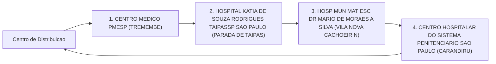
_Fluxo operacional da Rota 4._

---

# Rota 5: Entrega Hospitalar

## Resumo Operacional

| Item                     | Descrição                          |
|--------------------------|------------------------------------|
| **Veículo**              | CITROEN AIRCROSS                   |
| **Capacidade**           | 350 kg                             |
| **Autonomia**            | 395 km                             |
| **Distância Total**      | 112.3 km                           |
| **Duração Estimada**     | 165 min                            |
| **Carga Total**          | 347.9 kg                           |

## Checklist Antes da Partida

- [ ] Verificar a carga total e garantir que não exceda a capacidade do veículo.
- [ ] Conferir a autonomia do veículo e o combustível disponível.
- [ ] Checar a documentação necessária para transporte.
- [ ] Confirmar a lista de entregas e endereços.
- [ ] Garantir que todos os medicamentos estejam devidamente acondicionados e identificados.
- [ ] Equipar o veículo com kit de primeiros socorros e materiais de emergência.

## Paradas de Entrega

| Nº | Local de Entrega                                                  | Prioridade | Carga (kg) | Orientação                                       |
|----|------------------------------------------------------------------|------------|------------|--------------------------------------------------|
| 1  | HOSP MUN JOSANIAS CASTANHA BRAGA (JARDIM ROSCHEL)               | REGULAR    | 116.8      | Entregar na recepção, confirmar recebimento.     |
| 2  | HOSPITAL UNIVERSITARIO DA USP SAO PAULO (BUTANTA)               | REGULAR    | 98.6       | Entregar no setor de emergência, verificar assinatura. |
| 3  | HOSP MUN GILSON DE CASSIA MARQUES DE CARVALHO (VILA MASCOTE)    | REGULAR    | 17.0       | Entregar diretamente ao enfermeiro responsável.  |
| 4  | HOSP MUN JABAQUARA ARTUR RIBEIRO DE SABOYA (JABAQUARA)          | REGULAR    | 28.0       | Confirmar entrega com a equipe de logística.      |
| 5  | CENTRO DE REFERENCIA E TREINAMENTO DST AIDS SAO PAULO (VILA MARIANA) | REGULAR | 87.5       | Entregar na sala de medicamentos, obter confirmação. |

## Alertas de Segurança

⚠️ **Cuidado com medicamentos**: Verifique a temperatura e o estado dos medicamentos durante o transporte. 

🚨 **Entrega Crítica**: A entrega deve ser realizada dentro do prazo para evitar comprometimento da saúde dos pacientes.

## Checklist de Encerramento

- [ ] Confirmar que todas as entregas foram realizadas.
- [ ] Obter assinaturas de recebimento em todos os locais.
- [ ] Verificar a condição do veículo após a entrega.
- [ ] Registrar qualquer incidente ou atraso durante o percurso.
- [ ] Retornar ao ponto de partida e realizar a entrega de documentos necessários.

## Fluxo da rota

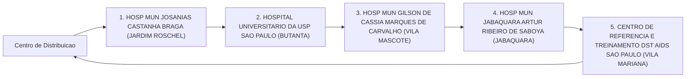
_Fluxo operacional da Rota 5._

---

# Rota 6: Entrega Hospitalar

## Resumo Operacional

| Item                        | Detalhes                      |
|-----------------------------|-------------------------------|
| **Veículo**                 | VW VIRTUS                     |
| **Capacidade**              | 350 kg                        |
| **Autonomia**               | 415 km                        |
| **Distância Total**         | 113.1 km                      |
| **Duração Estimada**        | 183.7 min                     |
| **Carga Total**             | 278.9 kg                      |

## Checklist Antes da Partida

- [ ] Verificar nível de combustível do veículo
- [ ] Conferir a carga total e peso
- [ ] Checar a documentação do veículo
- [ ] Confirmar a lista de entregas e endereços
- [ ] Garantir que os medicamentos estão devidamente acondicionados e identificados
- [ ] Revisar o itinerário e condições do trânsito

## Paradas Programadas

| Nº | Local de Entrega                                                        | Prioridade | Carga   | Orientação                          |
|----|-------------------------------------------------------------------------|------------|---------|-------------------------------------|
| 1  | INSTITUTO DO CANCER DO ESTADO DE SAO PAULO (CERQUEIRA CESAR)          | REGULAR    | 22.1 kg | Entregar no setor de oncologia      |
| 2  | INSTITUTO DE REABILITACAO LUCY MONTORO (VILA ANDRADE)                 | REGULAR    | 20.0 kg | Entregar na recepção                |
| 3  | HOSPITAL MATERNIDADE INTERLAGOS (JD LEBLON)                            | REGULAR    | 34.1 kg | Entregar no setor de maternidade     |
| 4  | HOSPITAL GERAL DO GRAJAU PROF LIBER JOHN ALPHONSE DI DIO SP (PARQUE DAS NACOES) | REGULAR    | 101.2 kg| Entregar no setor de emergência      |
| 5  | HOSP MUN TIDE SETUBAL (SAO MIGUEL PAULISTA)                           | REGULAR    | 81.3 kg | Entregar no setor de internação     |
| 6  | HOSPITAL GERAL DE SAO MATEUS SAO PAULO (SAO MATEUS)                   | REGULAR    | 20.2 kg | Entregar na recepção                |

## Alertas de Segurança

⚠️ **Atenção:** Verificar se a carga inclui medicamentos que requerem cuidados especiais durante o transporte. 

🚨 **Entrega Crítica:** Assegurar que a entrega no HOSPITAL GERAL DO GRAJAU seja feita com prioridade, devido à carga significativa.

## Checklist de Encerramento

- [ ] Confirmar a entrega de todas as cargas
- [ ] Coletar assinaturas de recebimento
- [ ] Verificar se não há itens esquecidos no veículo
- [ ] Registrar qualquer incidente ou atraso durante a entrega
- [ ] Preencher relatório de entrega e enviar para a central de logística

## Fluxo da rota

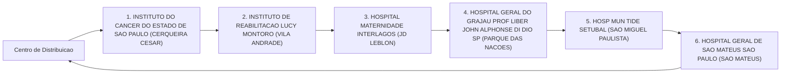
_Fluxo operacional da Rota 6._

---

# Rota 7: Entrega Hospitalar

## Resumo Operacional

| Item                       | Detalhes                     |
|----------------------------|------------------------------|
| **Veículo**                | PEUGEOT 208                  |
| **Capacidade**             | 350 kg                       |
| **Autonomia**              | 415 km                       |
| **Distância Total**        | 91.8 km                      |
| **Duração Estimada**       | 152.9 min                    |
| **Carga Total**            | 315.7 kg                     |

## Checklist Antes da Partida

- [ ] Verificar a carga total (315.7 kg) e garantir que não exceda a capacidade do veículo (350 kg).
- [ ] Conferir a autonomia do veículo (415 km) em relação à distância total (91.8 km).
- [ ] Checar o estado do veículo (combustível, pneus, freios).
- [ ] Confirmar a documentação necessária para transporte.
- [ ] Garantir que todos os medicamentos estejam devidamente armazenados e identificados.

## Paradas Programadas

| Nº | Local de Entrega                                               | Prioridade | Carga (kg) | Orientação                      |
|----|---------------------------------------------------------------|------------|------------|---------------------------------|
| 1  | HOSPITAL HELIOPOLIS UNIDADE DE GESTAO ASSISTENCIAL I         | REGULAR    | 81.5       | Entregar na recepção            |
| 2  | HOSP MUN SOROCABANA                                          | REGULAR    | 11.3       | Entregar no setor de emergência  |
| 3  | CAISM PHILIPPE PINEL SAO PAULO                               | REGULAR    | 47.4       | Entregar na sala de medicamentos |
| 4  | INSTITUTO DE INFECTOLOGIA EMILIO RIBAS                       | REGULAR    | 108.1      | Entregar na farmácia            |
| 5  | HOSPITAL REGIONAL SUL SAO PAULO                              | REGULAR    | 33.2       | Entregar na ala pediátrica      |
| 6  | HOSPITAL INFANTIL DARCY VARGAS UGA III SAO PAULO            | REGULAR    | 34.2       | Entregar na recepção            |

## Alertas de Segurança

⚠️ **Cuidado com medicamentos**: Verifique a temperatura e as condições de armazenamento durante o transporte.

🚨 **Entrega Crítica**: Assegure-se de que as entregas sejam feitas dentro do prazo para garantir a eficácia dos medicamentos.

## Checklist de Encerramento

- [ ] Confirmar a entrega de todos os itens nas respectivas unidades.
- [ ] Coletar assinaturas de recebimento onde necessário.
- [ ] Verificar se a carga foi descarregada corretamente.
- [ ] Realizar uma inspeção final no veículo.
- [ ] Registrar qualquer incidente ou anomalia durante o percurso.

## Fluxo da rota

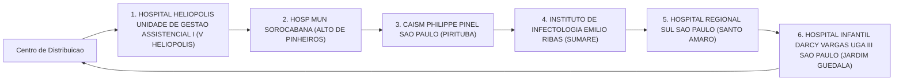
_Fluxo operacional da Rota 7._

---

# Rota 8: Entrega Hospitalar

## Resumo Operacional

| Item                       | Detalhes                |
|----------------------------|-------------------------|
| **Veículo**                | Hyundai CRETA           |
| **Capacidade**             | 350 kg                  |
| **Autonomia**              | 420 km                  |
| **Distância Total**        | 85.8 km                 |
| **Duração Estimada**       | 132.9 min               |
| **Carga Total**            | 322.5 kg                |

## Checklist Antes da Partida

- [ ] Verificar nível de combustível do veículo
- [ ] Conferir a carga total e peso
- [ ] Checar a documentação necessária
- [ ] Garantir que todos os medicamentos estejam devidamente embalados e identificados
- [ ] Confirmar a rota e paradas programadas
- [ ] Testar o funcionamento do GPS

## Paradas Programadas

| Nº | Local de Entrega                                                   | Prioridade | Carga (kg) | Orientação                          |
|----|-------------------------------------------------------------------|------------|------------|-------------------------------------|
| 1  | HOSP MUN MATERNIDADE PROFESSOR MARIO DEGNI (VILA ANTONIO)        | REGULAR    | 99.0       | Entregar na recepção do hospital    |
| 2  | HOSP MUN CAPELA DO SOCORRO (JARDIM DAS IMBUIAS)                 | REGULAR    | 119.6      | Conferir documentos na entrada      |
| 3  | HOSPITAL GERAL DE PEDREIRA (VILA CAMPO GRANDE)                   | REGULAR    | 12.9       | Entregar diretamente ao enfermeiro  |
| 4  | HOSPITAL MUNICIPAL GUARAPIRANGA (RIVIERA PAULISTA)               | REGULAR    | 91.0       | Seguir protocolo de entrega          |

## Alertas de Segurança

⚠️ **Atenção:** Verificar se a carga inclui medicamentos que necessitam de cuidados especiais durante o transporte. 

🚨 **Entrega Crítica:** Todos os medicamentos devem ser entregues com prioridade e em conformidade com as normas de segurança.

## Checklist de Encerramento

- [ ] Confirmar a entrega de todas as cargas
- [ ] Coletar assinaturas de recebimento
- [ ] Verificar se não há itens esquecidos no veículo
- [ ] Registrar qualquer incidente ou atraso
- [ ] Retornar ao ponto de partida e abastecer o veículo, se necessário
- [ ] Realizar uma última checagem na documentação e carga antes de finalizar a jornada

## Fluxo da rota

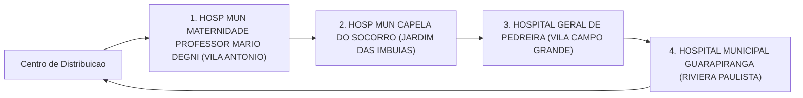
_Fluxo operacional da Rota 8._

---

# Rota 9: Entrega Hospitalar

## Resumo Operacional

| Item                     | Detalhes                          |
|--------------------------|-----------------------------------|
| **Veículo**              | FIAT FASTBACK                     |
| **Capacidade**           | 350 kg                            |
| **Autonomia**            | 445 km                            |
| **Distância Total**      | 88.7 km                           |
| **Duração Estimada**     | 146.1 min                         |
| **Carga Total**          | 295.0 kg                          |

## Checklist Antes da Partida

- [ ] Verificar a carga total (295.0 kg) e garantir que não exceda a capacidade do veículo.
- [ ] Confirmar que o veículo está em boas condições de funcionamento (pneus, freios, combustível).
- [ ] Checar a documentação necessária para transporte.
- [ ] Garantir que todos os medicamentos estejam devidamente embalados e identificados.
- [ ] Revisar o itinerário e as paradas programadas.

## Paradas Programadas

| Nº | Local de Entrega                                                                 | Prioridade | Carga (kg) | Orientação                        |
|----|----------------------------------------------------------------------------------|------------|------------|-----------------------------------|
| 1  | HOSPITAL GERAL DE VILA PENTEADO DR JOSE PANGELLA SAO PAULO (JARDIM IRACEMA)   | REGULAR    | 82.1       | Entregar medicamentos com cuidado.|
| 2  | HOSP DO SERV PUB MUNICIPAL HSPM (LIBERDADE)                                    | REGULAR    | 110.6      | Verificar se há necessidade de assinatura. |
| 3  | HOSP MUN PROF DR WALDOMIRO DE PAULA (ITAQUERA)                                 | REGULAR    | 51.6       | Confirmar recebimento da carga.   |
| 4  | HOSPITAL GERAL JESUS TEIXEIRA DA COSTA GUAIANASES SAO PAULO (JARDIM SAO PAULO)| REGULAR    | 50.7       | Finalizar entrega e coletar feedback. |

## Alertas de Segurança

⚠️ **Cuidado com Medicamentos**: Manter a carga em temperatura adequada e evitar exposição à luz direta.

🚨 **Entrega Crítica**: A entrega deve ser realizada dentro do prazo estipulado para garantir a eficácia dos medicamentos.

## Checklist de Encerramento

- [ ] Confirmar que todas as entregas foram realizadas.
- [ ] Coletar assinaturas de recebimento onde necessário.
- [ ] Verificar se não há itens esquecidos no veículo.
- [ ] Registrar qualquer incidente ou atraso durante a rota.
- [ ] Retornar ao ponto de partida e realizar a entrega de relatórios, se necessário.

## Fluxo da rota

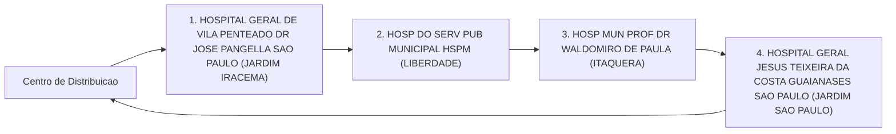
_Fluxo operacional da Rota 9._

---

# Rota 10: Entrega Hospitalar

## Resumo Operacional

| Item                   | Detalhes                        |
|------------------------|---------------------------------|
| **Veículo**            | CITROEN AIRCROSS               |
| **Capacidade**         | 350 kg                         |
| **Autonomia**          | 395 km                         |
| **Distância Total**    | 57.5 km                        |
| **Duração Estimada**    | 91.9 min                       |
| **Carga Total**        | 285.5 kg                       |

## Checklist Antes da Partida

- [ ] Verificar a carga total (285.5 kg) e garantir que não exceda a capacidade do veículo.
- [ ] Confirmar que o veículo está em boas condições de funcionamento.
- [ ] Checar a documentação necessária para transporte de cargas hospitalares.
- [ ] Revisar a lista de entregas e prioridades.
- [ ] Garantir que os medicamentos estejam devidamente acondicionados e identificados. ⚠️

## Paradas Programadas

| #  | Local de Entrega                                                       | Prioridade | Carga (kg) | Orientação                               |
|----|-----------------------------------------------------------------------|------------|------------|------------------------------------------|
| 1  | HOSP MUN VER JOSE STOROPOLLI (PARQUE NOVO MUNDO)                     | REGULAR    | 74.3       | Entregar na recepção do hospital.       |
| 2  | HOSPITAL E MATERNIDADE LEONOR MENDES DE BARROS SAO PAULO (BELENZINHO) | REGULAR    | 104.8      | Entregar no setor de maternidade.       |
| 3  | HOSPITAL ESTADUAL DE SAPOPEMBA SAO PAULO (JARDIM SAPOPEMBA)         | REGULAR    | 106.4      | Entregar no pronto-socorro.             |

## Alertas de Segurança

- 🚨 **Entregas Críticas**: Medicamentos e materiais sensíveis devem ser transportados com cuidado.
- ⚠️ **Cuidados com Medicamentos**: Verificar a temperatura e a integridade dos produtos durante o transporte.

## Checklist de Encerramento

- [ ] Confirmar a entrega de todas as cargas nos locais designados. ✅
- [ ] Coletar assinaturas de recebimento nos locais de entrega.
- [ ] Verificar se há cargas remanescentes no veículo.
- [ ] Registrar qualquer incidente ou atraso durante o percurso.
- [ ] Retornar ao ponto de partida e realizar a limpeza do veículo.

## Fluxo da rota

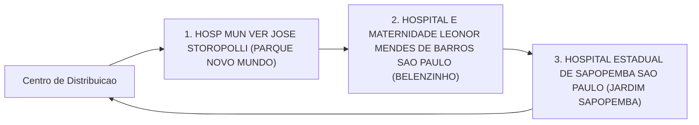
_Fluxo operacional da Rota 10._

---

# Rota 11: Entrega Hospitalar

## Resumo Operacional

| Item                     | Detalhe                |
|--------------------------|-----------------------|
| Veículo                  | VW VIRTUS             |
| Capacidade               | 350 kg                |
| Autonomia                | 415 km                |
| Distância Total          | 31.2 km               |
| Duração Estimada         | 58.3 min              |
| Carga Total              | 202.0 kg              |

## Checklist Antes da Partida

- [ ] Verificar nível de combustível do veículo.
- [ ] Conferir a carga total e seu peso (202.0 kg).
- [ ] Confirmar que a carga está devidamente fixada.
- [ ] Revisar a documentação necessária para transporte.
- [ ] Checar condições climáticas e de tráfego.
- [ ] Garantir que todos os equipamentos de segurança estão a bordo.

## Paradas Programadas

| Nº | Local de Entrega                                           | Prioridade | Carga   | Orientação                          |
|----|-----------------------------------------------------------|------------|---------|-------------------------------------|
| 1  | CONJUNTO HOSPITALAR DO MANDAQUI SAO PAULO (SANTANA)      | REGULAR    | 98.8 kg | Entregar no setor de emergência.    |
| 2  | UNIDADE DE GESTAO ASSISTENCIAL II HOSPITAL IPIRANGA SP    | REGULAR    | 103.2 kg| Entregar na recepção principal.     |

## Alertas de Segurança

⚠️ **Cuidado com medicamentos**: Verifique se a carga contém medicamentos que exigem condições especiais de transporte.

🚨 **Entrega Crítica**: Assegure-se de que a entrega no CONJUNTO HOSPITALAR DO MANDAQUI seja realizada com prioridade.

## Checklist de Encerramento

- [ ] Confirmar a entrega de todas as cargas.
- [ ] Obter assinatura de recebimento nos locais de entrega.
- [ ] Verificar se há necessidade de retorno ao hospital para novas instruções.
- [ ] Realizar uma inspeção final no veículo.
- [ ] Registrar qualquer incidente ou observação durante a rota.

## Fluxo da rota

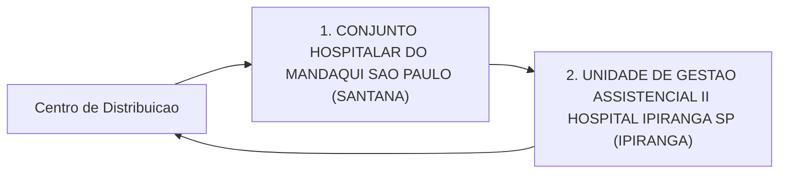
_Fluxo operacional da Rota 11._

---
