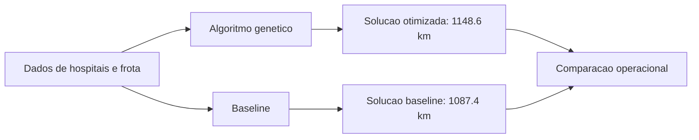

# Relatório Operacional Executivo: Eficiência das Rotas de Distribuição de Medicamentos Hospitalares

## Resumo Executivo
Este relatório analisa a eficiência das rotas de distribuição de medicamentos hospitalares, comparando a solução otimizada com a baseline. A análise revela uma leve redução na distância total percorrida, mas um aumento na duração total das entregas. A priorização de entregas críticas melhorou significativamente, indicando uma maior eficiência na gestão das entregas.

## Tabela Comparativa

| Indicador                     | Otimizado      | Baseline       | Variação                |
|-------------------------------|----------------|----------------|-------------------------|
| Veículos utilizados            | 11             | 11             | -                       |
| Distância total (km)          | 1148.6         | 1087.4         | -61.1 (-5.6%)           |
| Duração total (min)           | 1680.3         | 1613.3         | +67.0 (+4.1%)           |
| Entregas não atendidas         | 0              | 0              | -                       |
| Posição média de entregas críticas | 8.7ª        | 20.7ª          | +12.0 (melhora)         |

## Indicadores Operacionais
- **Veículos utilizados:** 11 em ambas as soluções, mantendo a capacidade de entrega.
- **Distância total:** A solução otimizada percorreu 61.1 km a mais, resultando em uma economia de distância de -5.6%.
- **Duração total:** A duração das entregas aumentou em 67 minutos, representando um acréscimo de 4.1%.
- **Entregas não atendidas:** Nenhuma entrega não atendida em ambas as soluções.
- **Priorização de entregas críticas:** A posição média de entregas críticas melhorou de 20.7ª para 8.7ª, evidenciando uma gestão mais eficiente.

## Análise de Entregas Críticas
A priorização das entregas críticas foi um dos principais ganhos da solução otimizada. A média de posição das entregas críticas foi reduzida em 12 posições, o que demonstra uma resposta mais ágil às necessidades urgentes.

## Riscos
- **Aumento da Duração Total:** O aumento na duração total das entregas pode impactar a satisfação dos usuários e a eficiência operacional.
- **Dependência de Veículos:** A manutenção da frota de 11 veículos é crucial. Qualquer falha pode comprometer a entrega.

## Recomendações Priorizadas
1. **Revisão das Rotas:** Analisar as rotas para identificar pontos que possam ser otimizados para reduzir a duração total.
2. **Capacitação da Equipe:** Treinar a equipe de logística para melhorar a gestão do tempo e priorização de entregas.
3. **Monitoramento Contínuo:** Implementar um sistema de monitoramento das rotas em tempo real para ajustes dinâmicos.

## Conclusão
A análise das rotas de distribuição de medicamentos hospitalares revela que, embora a distância total tenha aumentado, a priorização de entregas críticas melhorou significativamente. As recomendações apresentadas visam otimizar ainda mais a eficiência das rotas, garantindo a entrega pontual e segura dos medicamentos. A continuidade do monitoramento e a implementação das sugestões poderão trazer melhorias adicionais na operação logística hospitalar.

## Fluxo comparativo

_Fluxo de comparacao das estrategias de roteamento._